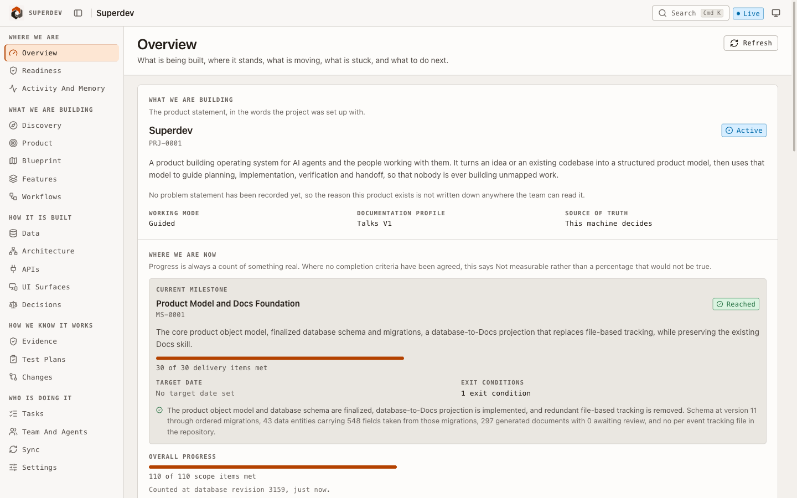
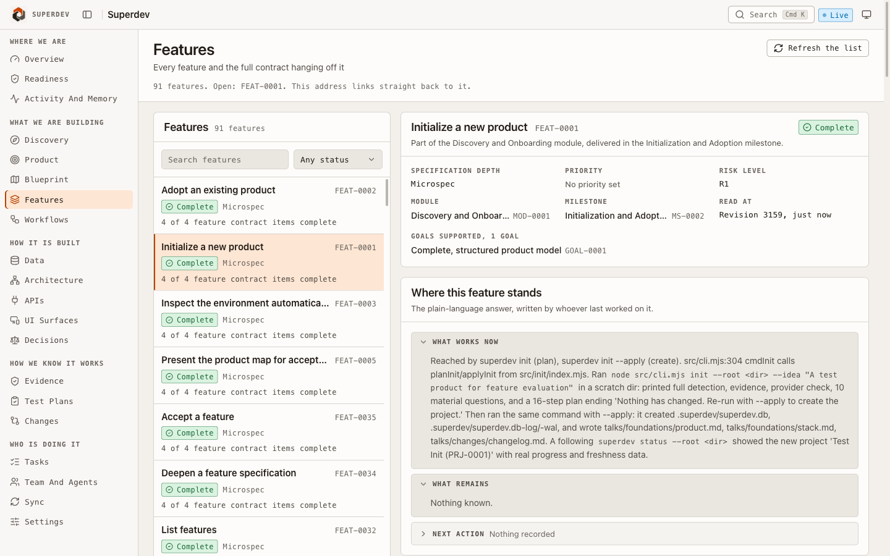
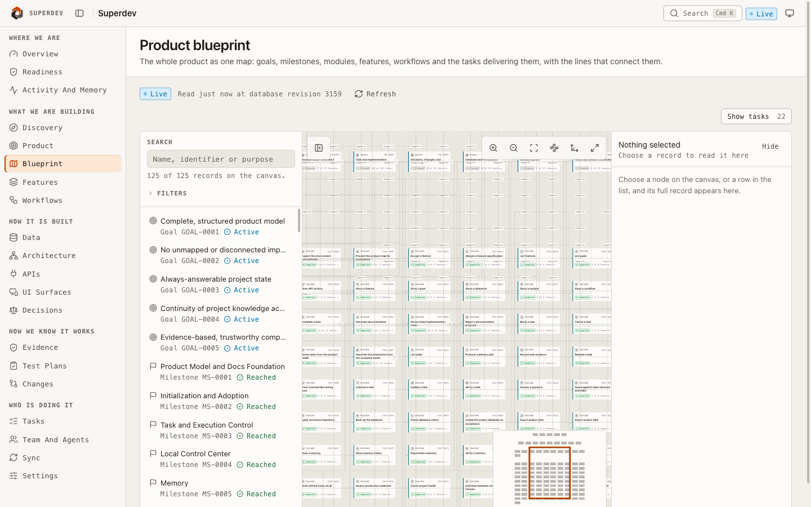

<p align="center">
  
</p>

<h1 align="center">Superdev</h1>

<p align="center">
  <strong>Keep your coding agent honest about what is built, why, and what proves it.</strong>
</p>

<p align="center">
  <a href="https://www.npmjs.com/package/superdev-cli"></a>
  <a href="LICENSE"></a>
  
  
</p>

<p align="center">
  
</p>

## Table of Contents

- [Overview](#overview)
- [The rules it enforces](#the-rules-it-enforces)
- [Prerequisites](#prerequisites)
- [Installation](#installation)
  - [Step 1: the CLI](#step-1-the-cli)
  - [Step 2: the plugin](#step-2-the-plugin)
  - [Claude Code](#claude-code)
  - [Codex](#codex)
  - [Cursor](#cursor)
  - [Any other editor](#any-other-editor)
- [Quick Start](#quick-start)
- [Commands](#commands)
  - [superdev init](#superdev-init)
  - [superdev adopt](#superdev-adopt)
  - [superdev status](#superdev-status)
  - [superdev resume](#superdev-resume)
  - [superdev feature](#superdev-feature)
  - [superdev derive](#superdev-derive)
  - [superdev task](#superdev-task)
  - [superdev verify](#superdev-verify)
  - [superdev test-plan](#superdev-test-plan)
  - [superdev decision](#superdev-decision)
  - [superdev docs](#superdev-docs)
  - [superdev memory](#superdev-memory)
  - [superdev doctor](#superdev-doctor)
  - [superdev readiness](#superdev-readiness)
  - [superdev ui](#superdev-ui)
  - [superdev db](#superdev-db)
  - [superdev cloud and sync](#superdev-cloud-and-sync)
  - [superdev settings](#superdev-settings)
  - [Product map commands](#product-map-commands)
  - [Global options and exit codes](#global-options-and-exit-codes)
- [The Dashboard](#the-dashboard)
- [Workflow Examples](#workflow-examples)
- [Updates and Versioning](#updates-and-versioning)
- [Privacy](#privacy)
- [Providers](#providers)
- [Troubleshooting](#troubleshooting)
- [Folder Structure](#folder-structure)
- [Development](#development)
- [Releasing](#releasing)
- [Contributing](#contributing)
- [License](#license)

## Overview

Working with a coding agent across many sessions has a familiar failure mode.
It rebuilds something already finished. It contradicts a decision you made last
week. It tells you a feature is done when nothing verified it. The plan lives in
a conversation that scrolls away, and the documentation describes last month.

Superdev gives the agent a project record it cannot talk its way around. Goals,
features, workflows, decisions, tasks and evidence live in a database on your
machine, and every surface reads from the same place: the command line, the
generated Markdown, the dashboard, and the agent working beside you.

It will not make your code correct. What it removes is ambiguity, forgotten
context, undocumented decisions, and the distance between what a status report
says and what is true.

Superdev ships in two pieces:

| | What it is | Where it comes from |
|---|---|---|
| **`superdev-cli`** | The engine. Every command, the database, the dashboard. | npm |
| **The plugin** | The skills your agent reads, and the lifecycle hooks. | git, through your editor |

They share one version. A release moves both.

## The rules it enforces

These are the whole idea. Everything else is machinery for keeping them true.

| Rule | What it feels like |
|---|---|
| **Completion is derived, never claimed** | A feature finishes when every acceptance criterion under it is met or waived and every task against it is closed. Nobody can mark it done. |
| **No evidence, no completion** | `task complete` refuses until the work carries a passing result, and until the accepted test plan covering it has been run. |
| **Every task implements something** | A task cannot leave draft without a link to a criterion, a workflow step, an operation or an entity. |
| **Nothing changes status quietly** | Status moves through lifecycle commands that write history. A direct update is refused by a database trigger. |
| **History is append only** | Enforced by triggers. What happened cannot be quietly revised later. |
| **Plan first, apply second** | Every command that would change something prints its plan and changes nothing until you add `--apply`. |
| **A refusal names the next step** | Every refusal says what to run to get past it. |

## Prerequisites

- **Node.js 20 or newer.** That is the only prerequisite.
- **npm**, which comes with Node.

Nothing to compile, no build step, no service to configure. npm fetches the
right database engine for your platform.

## Installation

### Step 1: the CLI

```bash
npm install -g superdev-cli
```

Confirm it:

```bash
superdev --version
```

Prefer not to install globally? Every command works through
`npx superdev-cli <command>`.

### Step 2: the plugin

The CLI does the work on its own. The plugin is what teaches your agent to drive
it, so you never have to remember a command name.

### Claude Code

```bash
claude plugin marketplace add superdev-ai/superdev
claude plugin install superdev@superdev
```

The plugin calls the `superdev` from step 1. Nothing in it is compiled and it
installs no dependency of its own: its hooks and skills invoke the command, not
code inside the plugin.

It is distributed as this repository, so the copy your editor caches also
contains the CLI source it does not use. That is dead weight rather than a second
installation, and the version that runs is always the one npm installed.

To try it without installing permanently:

```bash
claude --plugin-dir /path/to/a/clone
```

**If you skipped step 1**, your next session says so plainly rather than failing
cryptically: *"the plugin is installed and its command-line tool is not"*, with
the install command.

Then just describe what you want:

```
"Set up superdev here"
"I want to build a tool for tracking recipes I actually cook"
"What should I work on?"
"Review this against the spec"
"Open the dashboard"
```

### Codex

```bash
codex plugin marketplace add superdev-ai/superdev
codex plugin add superdev@superdev
```

The same eleven skills load. Two limits apply on Codex:

1. Lifecycle hooks do not fire until you explicitly trust each one. Until then,
   ask for status directly rather than expecting it to appear on its own.
2. Codex tool hooks cover shell commands only, so edits made through the editor
   do not mark documentation stale. Run `superdev docs generate` when you want it
   refreshed.

Neither affects correctness. The database is still the record either way.

### Cursor

Cursor has no plugin system Superdev installs into, so it uses the CLI plus a
rules file. You do not need the plugin at all.

Create `.cursor/rules/superdev.mdc` in your project:

```markdown
---
description: Use Superdev as the project record
alwaysApply: true
---

This project is tracked by Superdev. Its database is the authority on what is
being built, what is finished and what proves it. Do not keep project state in
chat. The command is `superdev`.

Before starting work:
- `superdev resume` to load the active task, blockers and next action
- `superdev status` to see where the project stands
- `superdev decision list` to check nothing decided contradicts the request

While working:
- `superdev task list`, then `task claim <id> --apply` to take one
- `superdev task start <id> --apply` before changing anything
- `superdev task evidence <id> --result pass --summary "<observed>" --command "<check>" --apply`
- `superdev task complete <id> --apply` last, and expect a refusal without evidence

For new behaviour:
- `superdev feature specify <id>`, then `feature accept <id> --apply`
- `superdev derive <id> --apply` for the tasks

Every command that changes something needs `--apply`. Without it you get a plan
and nothing is written. Add `--json` to parse output. `superdev --help` lists
everything.
```

The commands are the same ones verified everywhere else. The `.mdc` frontmatter
is Cursor's own format rather than something exercised here.

### Any other editor

Superdev is a command-line tool. Any agent that can run a shell command can use
it, and so can you.

```bash
cd ~/my-project
superdev init --brief requirements.md --apply
superdev status
```

## Quick Start

```bash
mkdir ~/recipe-keeper && cd ~/recipe-keeper
```

Write a short brief. Plain language, and there is a template with every section
explained in [requirement.md](requirement.md) if you want one:

```markdown
# Recipe Keeper

A tool for keeping the recipes I actually cook, not the ones I bookmark.

## Features

- Save a recipe with its ingredients and steps.
- Mark a recipe as cooked, with the date.
- See which recipes I have not cooked in six months.
```

Then:

```bash
superdev init --brief brief.md            # shows the plan, writes nothing
superdev init --brief brief.md --apply    # now it writes
superdev ui --apply                       # open the dashboard
```

You get the three features the brief names, a project named from the document's
own title, and a list of questions the brief did not answer. Nothing is invented
to fill a gap.

The headings are not decoration: Superdev classifies what it reads by the heading
it sits under, so `## Features` becomes features and `## Constraints` becomes
constraints. [requirement.md](requirement.md) lists every heading it recognises,
what each becomes, and a complete worked example. A section you leave out becomes
a recorded question rather than an assumption.

## Commands

Every command that changes something takes `--apply`. Without it you get the
plan and nothing happens. `superdev --help` lists the full surface.

### `superdev init`

Start a project from an idea, a brief, or a folder of notes.

```bash
# From a written brief
superdev init --brief requirements.md --apply

# From a sentence
superdev init --idea "A reading list app with a weekly digest" --name "Readlist" --apply

# See what it would do first
superdev init --brief requirements.md
```

**Options:** `--brief <file>`, `--idea <text>`, `--name <text>`, `--apply`

It inspects the repository before asking anything, records what the source
material states, and records what it does not as open questions rather than
guesses.

### `superdev adopt`

Take on a codebase that already exists.

```bash
superdev adopt --apply
```

It reads your conventions and documentation without overwriting them, and labels
everything it inferred rather than presenting a guess as a fact.

### `superdev status`

Where the project is, how fresh that is, and what is next.

```bash
superdev status
superdev status --json           # for scripts
superdev status --root ~/other   # another project
```

```
Progress
--------
Overall: 100 percent (110 of 110 tracked items done)
  Accepted features delivered  91 of 91
  Milestones reached           9 of 9
  Goal success criteria met    10 of 10

Next
----
Nothing is pending
```

Progress is counted from declared deliverables and attached verification. Where
nothing has been agreed to measure, it says **Not measurable** rather than
showing a percentage that would not be true.

### `superdev resume`

Everything a new session needs to carry on, after a break, a handoff or a
compaction.

```bash
superdev resume            # read it
superdev resume --apply    # and open a work session
superdev resume --end --apply
```

Returns the objective, the active task, its contract, governing decisions,
blockers, the last verified evidence, and the recorded next action.

### `superdev feature`

Define what to build, at a depth proportionate to its risk.

```bash
# What is missing before this can be accepted
superdev feature depth FEAT-0001

# Write the specification
superdev feature specify FEAT-0001 \
  --purpose "Save a recipe so it can be cooked again" \
  --user "A cook wants their own recipe back without searching a browser" \
  --in "Saving a recipe with ingredients and steps" \
  --out "Importing from other sites" \
  --flow "Open the new recipe screen" \
  --flow "Enter the name, ingredients and steps" \
  --flow "Save it and see it in the list" \
  --criterion "A saved recipe survives a restart || Save one, restart, read it back" \
  --edge "empty_states:The list says there are no recipes yet" \
  --edge "invalid_input:A recipe with no name is refused with a reason" \
  --apply

# Change how much it owes
superdev feature depth FEAT-0001 standard

# Accept it. Refused while anything above is missing.
superdev feature accept FEAT-0001 --apply

# Set a criterion aside, with the reason on the record
superdev feature waive AC-0003 --reason "Deferred to the next milestone" --apply

# Read one in full
superdev feature show FEAT-0001
superdev feature list
```

**Three depths.** *Microspec* wants purpose, who wants it, scope in and out, the
primary flow, acceptance criteria and edge cases. *Standard* adds surfaces,
operations, entities, permissions, workflow steps, observability and a test plan.
*Full design* adds alternatives considered, migration and rollback, capacity
targets, failure recovery and decision records.

A refusal names everything missing at once:

```
Save a recipe is declared standard depth, and 9 of the 11 things that depth
promises are missing: what is in scope and what is deliberately out; the primary
flow, step by step; how anyone can tell it works; ...
```

<p align="center">
  
</p>

### `superdev derive`

Turn accepted specifications into tasks.

```bash
superdev derive FEAT-0001 --apply    # one feature
superdev derive --apply              # everything accepted
```

Tasks come from the accepted specification rather than from a list somebody
wrote. Each belongs to exactly one feature and links to the contract it
implements.

### `superdev task`

The execution lifecycle.

```bash
superdev task list                    # open tasks, oldest first
superdev task list --all              # including finished
superdev task show TASK-0001

superdev task create --feature FEAT-0001 \
  --name "Store a recipe" \
  --outcome "A recipe survives a restart" \
  --verify "Save one, restart, read it back" --apply

superdev task update TASK-0001 --link acceptance_criterion:AC-0001 --apply
superdev task claim TASK-0001 --apply
superdev task start TASK-0001 --apply

superdev task evidence TASK-0001 \
  --result pass \
  --summary "Saved a recipe, restarted, read the same one back" \
  --command "npm test" \
  --criterion AC-0001 --apply

superdev task complete TASK-0001 --apply

superdev task block TASK-0001 --reason "Waiting on the API key" --apply
superdev task unblock TASK-0001 --apply
superdev task cancel TASK-0001 --reason "Superseded by FEAT-0009" --apply
superdev task reopen TASK-0001 --reason "The fix regressed" --apply
superdev task release TASK-0001 --apply
```

Completion refuses until the work is proven, and the refusal says how:

```
TASK-0002 verifies acceptance criteria that are still unmet: AC-0003 (A saved
recipe survives a restart). Attach a passing result to each with task evidence
TASK-0002 --criterion AC-0003, or waive it with feature waive AC-0003 --reason.
```

The feature above finishes on its own when its last task does.

### `superdev verify`

Re-run the checks your recorded evidence stands on.

```bash
superdev verify            # report what still passes
superdev verify --apply    # and mark anything that stopped passing as stale
```

```
  Evidence in force     121
  Carries a command     80
  Checked by hand only  41
  Re-ran                80
  Still passing         80
  No longer passing     0
```

Evidence that names a command can be checked again. Evidence checked by hand
says so, rather than carrying an invented command.

### `superdev test-plan`

How a feature or the product is verified, and whether anyone has run it.

```bash
superdev test-plan list
superdev test-plan show TP-0001
superdev test-plan run TP-0001 --apply       # runs it, records what it produced
superdev test-plan record TP-0007 \
  --summary "Opened every dashboard area and read each against the database" \
  --apply
```

A plan whose instruction is a command can be run. A plan whose instruction is a
journey is carried out by a person and recorded with what they saw. Task
completion is refused while a plan covering the work has no passing run.

### `superdev decision`

Record what was chosen and why, so it is not relitigated every week.

```bash
superdev decision list
superdev decision record \
  --title "Postgres over MySQL" \
  --decision "Postgres, for JSONB and partial indexes" \
  --rationale "Both were adequate; JSONB decided it" \
  --verification "The schema uses JSONB in three tables" --apply

superdev decision supersede DEC-0007 --apply
```

A request that contradicts an accepted decision surfaces that decision before
work starts. Changing one means superseding it, which keeps the chain.

Related:

```bash
superdev change record --summary "Dropped the digest email" --reason "Out of scope for v1" --apply
superdev assumption record --assumption "One user per account" --trigger "The first team signs up" --apply
superdev question list
superdev question answer Q-0001 --answer "Weekly, on Sunday" --apply
```

### `superdev docs`

Markdown generated from the database, never a second source of truth.

```bash
superdev docs generate --apply
superdev docs diff                       # what a hand edit changed
superdev docs accept talks/path/file.md --apply
superdev docs reject talks/path/file.md --apply
```

Edit a generated file and Superdev notices, shows you the difference, and asks.
It updates the database first, then regenerates. Your edit is never silently
overwritten and never treated as authority without you accepting it.

### `superdev memory`

Structured recall across sessions, captured from real events.

```bash
superdev memory search "why did we choose the storage engine"
superdev memory show MEM-0042
superdev memory verify MEM-0042        # check it against the current record
superdev memory consolidate --apply    # merge duplicates, mark contradictions
superdev memory status
superdev memory benchmark              # measure recall, precision, ranking
```

Every memory carries where it came from and links to the records it concerns.
Retrieval quality is measured rather than asserted, and described plainly:
structured filters plus a lexical index, with semantic search reported as a
bounded scan because that is what it would be.

### `superdev doctor`

Whether Superdev can work here, and what to do when it cannot.

```bash
superdev doctor
```

```
Check           Verdict  Detail
Storage engine  Pass     Installed and loaded
Database        Pass     Schema version 12 of 12, 0 migrations pending
Integrity       Pass     No page damage and no dangling references
Documentation   Pass     299 generated files match the database
Alignment       Pass     Every record maps to something that declares it
Freshness       Pass     Nothing is out of date
Providers       Pass     7 of 7 ready
Evidence        Pass     80 of 121 can be re-run. Run superdev verify.
```

### `superdev readiness`

The production-readiness checklist, gap by gap. Thirty-two areas, each either
specified, awaiting a decision, not applicable with a reason, or deferred with an
owner and a trigger.

```bash
superdev readiness
```

"Not yet considered" is not one of the answers.

### `superdev ui`

```bash
superdev ui --apply         # start and open
superdev start --apply
superdev stop --apply
superdev restart --apply
superdev services
```

### `superdev db`

```bash
superdev db status                       # schema version, integrity, row counts
superdev db migrate --apply              # apply pending migrations
superdev db backup --apply               # snapshot
superdev db restore <name> --apply       # put one back
superdev export project.json --apply     # move between machines
superdev import project.json --apply
```

Migrations are forward only, with a self-contained backup taken before every
run. Getting back means restoring that backup, which is why one is always taken.

`db migrate`, `db restore` and `import` all refuse while the dashboard is
running, and each refusal names the command that frees it.

### `superdev cloud and sync`

Optional, and inert until you configure it. Your local database is always the
authority.

```bash
superdev cloud connect ~/Dropbox/product-sync --apply   # creates a local key
superdev cloud status
superdev sync --dry-run                                 # what would move
superdev sync --apply                                   # move it
superdev sync --resolve                                 # list disagreements
superdev sync --resolve CONF-0001 --keep remote --apply  # settle one
```

- Everything sent is encrypted with a key created on your machine and never
  transmitted. Copy the key to your other machine yourself.
- A record changed in both copies is never overwritten. It becomes a conflict and
  you choose.
- Specifications, decisions, evidence and tasks travel. Memory, activity,
  sessions and identities never leave.
- The only transport is a directory you provide, such as a synced folder. There
  is no hosted service.

### `superdev settings`

```bash
superdev settings                                # what it checks on its own
superdev settings --no-update-check --apply      # stop checking
superdev settings --update-check --apply        # start again
```

### Product map commands

Read-only views of what has been recorded.

```bash
superdev module list           superdev module show MOD-0001
superdev goal list             superdev goal show GOAL-0001
superdev milestone list        superdev milestone show MS-0001
superdev workflow list         superdev workflow show WF-0001
superdev architecture show     superdev schema show [entity]
superdev api show              superdev integration list
superdev plan
```

### Global options and exit codes

| Option | What it does |
|---|---|
| `--apply` | Actually do it. Without this, every changing command prints its plan and changes nothing. |
| `--json` | Machine-readable output, and nothing else on stdout. |
| `--root <path>` | Which project. Defaults to the working directory. |
| `--out <path>` | Write this command's output to a file. |
| `--actor <name>` | Who to record as responsible. |
| `--version` | The CLI's name and version. |
| `--help` | The full command surface. |

| Exit code | Meaning |
|---|---|
| `0` | It worked. |
| `1` | Something was found, or refused. |
| `2` | The command was misused. |

## The Dashboard

```bash
superdev ui --apply
```

A local page at `127.0.0.1:4317`, served from a single self-contained file. It
reads the database on every request and follows it as you work.

Twenty areas, grouped by the question each answers:

| Group | Areas |
|---|---|
| Where we are | Overview, Readiness, Activity |
| What we are building | Discovery, Product, Blueprint, Features, Workflows |
| How it is built | Data, Architecture, APIs, Surfaces, Decisions |
| How we know it works | Evidence, Test Plans, Changes |
| Who is doing it | Tasks, Team, Sync, Settings |

The **Blueprint** is the whole project as one map, with pan, zoom, drag, search,
highlighting, fullscreen, and navigation into any record.

<p align="center">
  
</p>

A view that no navigation group contains fails the build, so an area cannot exist
without a way to reach it.

## Workflow Examples

### One feature, end to end

```bash
superdev feature specify FEAT-0001 --purpose "..." --user "..." \
  --in "..." --out "..." --flow "..." \
  --criterion "what is true || how it is checked" \
  --edge "empty_states:what happens when there is nothing" --apply
superdev feature accept FEAT-0001 --apply
superdev derive FEAT-0001 --apply
superdev task claim TASK-0001 --apply
superdev task start TASK-0001 --apply
# ... write the code ...
superdev task evidence TASK-0001 --result pass \
  --summary "what you observed" --command "npm test" --criterion AC-0001 --apply
superdev task complete TASK-0001 --apply
superdev docs generate --apply
```

### Picking up yesterday's work

```bash
superdev resume --apply     # objective, active task, blockers, next action
superdev task list          # or choose something else
```

### Before a release

```bash
superdev status             # derived progress
superdev doctor             # eight health checks
superdev verify             # re-run every recorded check
superdev readiness          # the production checklist
superdev docs diff          # nothing unreviewed on disk
```

### Two machines

```bash
# on the first
superdev cloud connect ~/Dropbox/product-sync --apply
superdev sync --apply

# copy .superdev/cloud/key to the second machine, then
superdev cloud connect ~/Dropbox/product-sync --alias laptop --apply
superdev sync --apply
```

## Updates and Versioning

The CLI and the plugin share one version, and a release moves both. Superdev
tells you when either has a newer release:

```
A newer Superdev CLI is available: 0.2.0, you have 0.1.0.
Update with npm install -g superdev-cli.

A newer Superdev plugin is available: 0.2.0, you have 0.1.0.
Update with claude plugin marketplace update superdev.
```

Updating:

```bash
npm install -g superdev-cli                    # the CLI
claude plugin marketplace update superdev      # the plugin
```

If the plugin ever needs a newer CLI than you have, your next session says so
directly, naming both versions, rather than letting a skill call a command that
does not exist yet.

**How the check behaves.** It is the only outbound request Superdev makes:

- **At most once a day**, and only after a command has already answered.
- **It never delays anything.** The notice comes from a file the previous check
  wrote, and the check runs in a separate process your command does not wait
  for. Measured: 165 ms with the check against 148 ms with it disabled.
- **It fails silently.** No network, a proxy, a firewall: nothing is printed and
  nothing is cached.
- **It writes to stderr**, so `--json` output is never affected.

Turning it off:

```bash
superdev settings --no-update-check --apply
export SUPERDEV_NO_UPDATE_CHECK=1      # for a container or a build
```

`CI=1` also disables it.

## Privacy

**Your project never leaves your machine.** No telemetry, no analytics, no crash
reporting. Every read and write of your project record is local, the dashboard
binds to `127.0.0.1` and refuses anything not same origin, and synchronization
only writes to a directory you name.

**One exception, and it is small.** The update check above asks the npm registry
for a version number and reads the plugin's manifest from this repository. What
that discloses is that somebody uses Superdev. It sends nothing about you or your
project, and one command turns it off.

Everything else follows. `npm install` fetches from the registry once, as any
install does. Installing an optional provider runs that provider's own installer,
which needs a network and is never implicit. And the agent harness you run
Superdev inside is a separate program with its own network behaviour.

Where your data lives:

```text
your-project/
  .superdev/            the database, backups and runtime state, git-ignored
  talks/                generated Markdown documentation, commit this
```

Nothing else is added. No dependency entry, no `node_modules`, no lockfile
change. There is no file per task, session or event; those are database records
and they show in the dashboard.

## Providers

Superdev works on its own. If these are installed it will use them, and if they
are not it says so and continues:

Superpowers (brainstorming, planning, test-driven development, systematic
debugging, review), Frontend Design, Impeccable, Claude Mem, envx, Find Skills,
Task Observer, skills.sh.

```bash
superdev integration list    # what each is for, and what happens when absent
superdev doctor              # which are present
```

Nothing is installed on your behalf, ever, and Superdev never presents its own
work as a provider's methodology.

## Troubleshooting

| Problem | Fix |
|---|---|
| `superdev: command not found` | `npm install -g superdev-cli`, then `superdev --version`. |
| The plugin says its command-line tool is not installed | Same fix. The plugin is text; the CLI does the work. |
| A session says the skills need a newer CLI | `npm install -g superdev-cli` to catch up. |
| `Cannot find package '@tursodatabase/database'` | The install did not finish. Run `npm install -g superdev-cli` again. |
| `No project in this directory` | `superdev init --apply`, or pass `--root /path/to/project`. |
| `db migrate` or `db restore` refuses | The dashboard is running. `superdev stop --apply` first. |
| A command printed a plan and changed nothing | That is the default. Add `--apply`. |
| `task complete` refuses | Read the refusal. It names the missing evidence or criterion and the command that fixes it. |
| The dashboard shows old data | `superdev docs generate --apply`, then reload. |
| Anything else | `superdev doctor` reports what is wrong and what to run. |

## Folder Structure

One repository, two published artifacts. The same tree becomes the npm package
and the plugin, so the two cannot drift apart: they are one commit.

```text
superdev/
│
├── src/                        THE CLI, published to npm as superdev-cli
│   ├── cli.mjs                 every command, and the only entry point
│   ├── db/                     storage, migrations, one writer at a time
│   │   └── migrations/         ordered SQL, applied forward only
│   ├── model/                  vocabulary, identifiers, content screening
│   ├── init/                   discovery, adoption, the interview
│   ├── features/               the depth gate, acceptance, completion
│   ├── tasks/                  the task lifecycle and its refusals
│   ├── verify/                 re-running the checks evidence stands on
│   ├── progress/               derived progress and alignment warnings
│   ├── decisions/              decision records and their chains
│   ├── product/                changes, assumptions, test plans
│   ├── memory/                 structured recall, provenance, benchmarking
│   ├── docs/                   the Markdown projection
│   ├── cloud/                  synchronization: policy, merge, leases, crypto
│   ├── service/                the local read model and HTTP service
│   │   └── assets/             the compiled dashboard, one inlined file
│   ├── runtime/                sessions, identity, hooks, version checking
│   └── cli/                    output rendering
│
├── skills/                     THE PLUGIN, distributed by git
│   ├── project/                the entry point skill, routes to the rest
│   ├── init/                   start a project, or adopt a codebase
│   ├── feature/                specify behaviour before it is built
│   ├── task/                   run the task lifecycle
│   ├── decision/               find, record, revisit, supersede
│   ├── status/                 report where things stand
│   ├── resume/                 rebuild context after a break
│   ├── review/                 check a change against what was accepted
│   ├── debug/                  investigate to root cause
│   ├── docs/                   the documentation engine
│   └── doctor/                 check the environment
│
├── hooks/
│   ├── hooks.json              which lifecycle events Superdev listens to
│   └── run.mjs                 finds the CLI and hands over, or says how to
│                               install it. Node builtins only, so the plugin
│                               needs no dependencies at all
│
├── .claude-plugin/             Claude Code plugin and marketplace manifests
├── .codex-plugin/              Codex plugin manifest
├── .github/workflows/          publishes to npm when a release is created
├── .release-it.json            how a release is cut
│
├── references/                 operating contracts the skills load on demand
│
├── scripts/
│   ├── validate/               fifteen validators, run by npm run validate
│   ├── check/                  the release condition gate
│   ├── doctor/                 environment and provider inspection
│   ├── providers/              the provider registry and detection
│   ├── privacy/                the leak scanner
│   ├── style/                  the writing style scanner
│   └── package/                dashboard build, version propagation
│
├── ui/                         dashboard source: React, TypeScript, Tailwind.
│                               Compiled into src/service/assets, and not
│                               published: what ships is the compiled file
│
├── docs/                       requirements, decisions, images
├── talks/                      this project's own generated documentation
│
├── package.json                the npm package: name, bin, files allowlist
├── LICENSE                     Apache 2.0
└── THIRD-PARTY-NOTICES.md      notices for what the dashboard compiles in
```

**Why the split works this way.** The plugin must be installable from git in one
command, and a git clone never carries `node_modules`. So everything needing the
database engine lives in the CLI, which npm installs properly, and the plugin
carries only text plus one dependency-free launcher. `hooks/run.mjs` is the seam:
it finds the installed `superdev` and hands the hook over, or explains what to
install.

## Development

```bash
git clone https://github.com/superdev-ai/superdev.git
cd superdev && npm install

npm run validate      # fifteen validators; must be clean
npm run check         # validators, doctor, and the release conditions
node src/cli.mjs doctor

cd ui && npm install && npm run lint    # the dashboard
npm run ui:build                        # compile it into the CLI
npm run ui:check                        # confirm the committed file is current
```

To run your checkout instead of the installed CLI, use `node src/cli.mjs` in
place of `superdev`, or `npm link` once.

```bash
npm test              # unit tests on pure functions, node --test, no framework
```

Testing here is deliberately narrow, and the boundary is enforced by a
validator. A `.test.mjs` beside the source it tests is allowed. A test
directory, a fixture project and every third-party framework are refused,
because each earlier attempt at a suite grew one and then measured completion in
test counts. A task still completes on recorded evidence about the real product:
a green suite is not evidence and a coverage figure is not progress.

What the tests cover is arithmetic no validator can check: version comparison,
the three-way merge, lease expiry, the gate on what may run unattended, the
brief parser, and the words the product puts in front of a reader. Products
built *with* Superdev get their own tests, derived from their accepted test
plans.

## Releasing

The CLI and the plugin share one version, so one release moves both.

```bash
npm run release:dry       # see what would happen
npm run release:patch     # 0.1.0 to 0.1.1
npm run release:minor     # 0.1.0 to 0.2.0
npm run release:major     # 0.1.0 to 1.0.0
```

What that does, in order:

1. Runs the gate: unit tests, validators, doctor, the release conditions, and a
   check that the committed dashboard matches its source. A release that cannot pass its own
   validators is not a release.
2. Bumps `package.json`, then propagates that version to both plugin manifests,
   the marketplace entry, and the CLI version each plugin declares it needs.
   A validator refuses a mismatch, so this cannot be forgotten quietly.
3. Writes `CHANGELOG.md` from conventional commits.
4. Commits, tags `v<version>`, pushes, and creates the GitHub release.
5. The GitHub release triggers `.github/workflows/release.yml`, which runs the
   gate again and publishes `superdev-cli` to npm.

The plugin needs no publish step. It is distributed by git, so the tag is the
release, and `claude plugin marketplace update superdev` reads it directly.

Release tooling is installed for the one command that needs it, with
`npm install --no-save`, rather than declared in the manifest. A validator
enforces that this repository carries no toolchain of its own, so the published
package has exactly one dependency: the storage engine. A maintainer cutting a
release is a different case from a user running the product.

## Contributing

Contributions are welcome. Read [CONTRIBUTING.md](CONTRIBUTING.md) first.

Two rules that surprise people:

- **Do not add test cases for Superdev itself.** A validator enforces this, and
  `CONTRIBUTING.md` explains what to write instead.
- **No emoji and no em dash** in anything the project owns. This is enforced at
  the storage boundary and by a validator, not merely requested.

When you report something, say what you ran and what you saw rather than what you
expected. By participating you agree to the
[Code of Conduct](CODE_OF_CONDUCT.md).

**Security.** Superdev holds your project's plans and decisions in a local
database. To report a vulnerability see [SECURITY.md](SECURITY.md). Please do not
open a public issue for a security problem.

## License

Released under the **[Apache License 2.0](LICENSE)**. You may use, modify and
distribute it, including commercially, provided you keep the licence and
copyright notices and state what you changed. It comes with no warranty.

The dashboard is compiled from React, Radix UI, xyflow, lucide, cmdk, dagre,
zustand and d3, all under MIT, ISC or BSD-3-Clause. Their notices travel with the
compiled file and are listed in
[THIRD-PARTY-NOTICES.md](THIRD-PARTY-NOTICES.md).

The storage engine is `@tursodatabase/database`, installed from npm and not
redistributed here.

---

<p align="center">
  <sub>Crafted for developers and agents, with care and precision.</sub>
</p>
