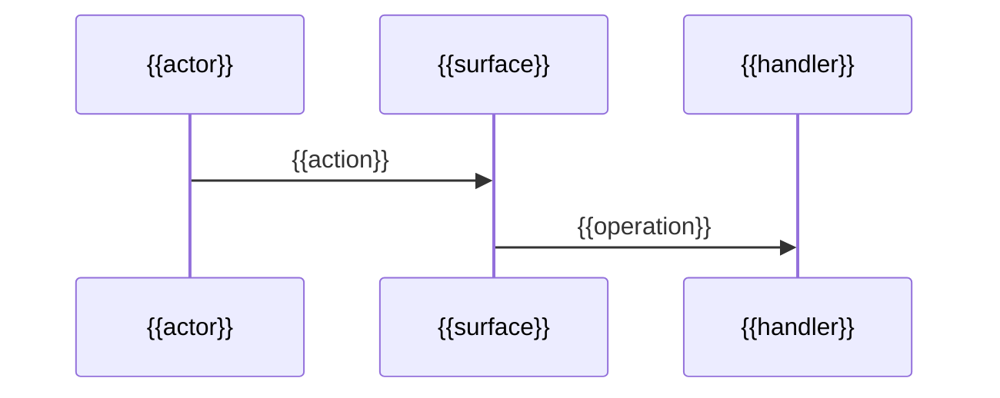

<!-- Template: architecture overview. Universal - diagram nodes use the project's
     real names from evidence; no invented vendors or stacks. -->
# {{project-name}} - Architecture

- **Status:** draft | accepted
- **Last verified:** {{revision}} on {{date}}

## Shape

{{one-paragraph-system-shape}}

## System context

```mermaid
graph LR
  {{actor}} --> {{system}}
  {{system}} --> {{external-dependency-from-evidence}}
```
*Claim: {{what-this-diagram-asserts}}*

## Runtime pieces

| Piece | Runs where | Talks to | Evidence |
|---|---|---|---|
| {{piece}} | {{runtime}} | {{peers}} | {{path}} |

## Module map

```mermaid
graph TD
  {{module-a}} --> {{module-b}}
```
*Claim: {{dependency-direction-assertion}}*

## Data ownership

| Entity group | Owning module | Consumers |
|---|---|---|
| {{entities}} | {{module}} | {{consumers}} |

## Critical path


*Claim: {{the-flow-the-product-exists-for}}*

## Boundaries and constraints

- {{boundary-or-constraint-with-evidence-or-adr}}
