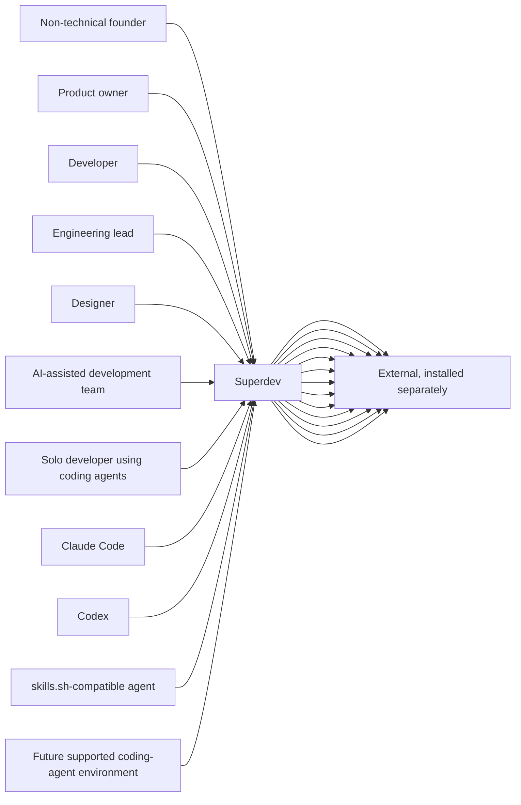
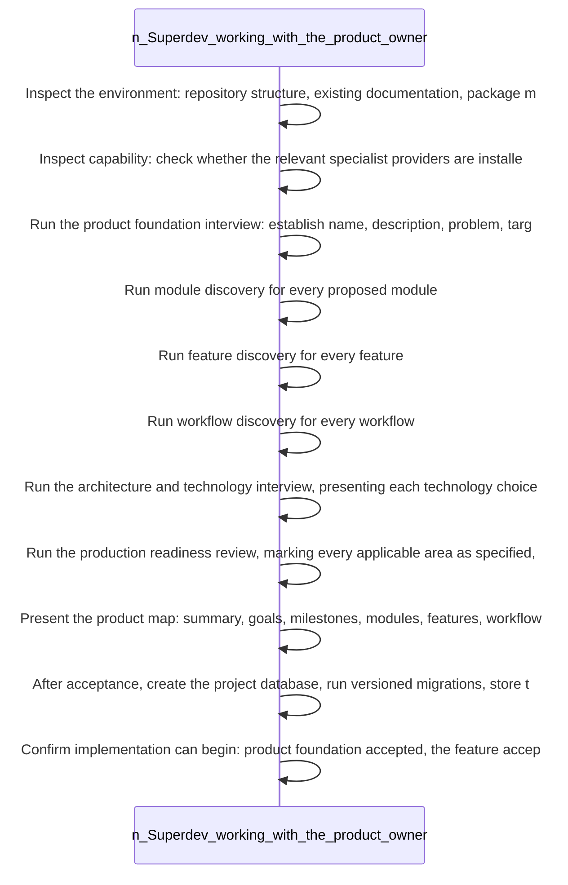

<!-- superdev:generated source=PRJ-0001 revision=1255 hash=9732ddcd7527fa35b5e80f7bf8862369b1c96015287ec150a4da48bcb0339b34 -->
# Superdev - Architecture

- **Status:** Active
- **Last verified:** see the generation marker at the top of this file.

## Shape

A product building operating system for AI agents and the people working with them. It turns an idea or an existing codebase into a structured product model, then uses that model to guide planning, implementation, verification and handoff, so that nobody is ever building unmapped work.

## System context

*Claim: 11 recorded roles reach the product, which depends on 13 recorded external integrations.*

## Runtime pieces

| Piece | Runs where | Talks to | Evidence |
|---|---|---|---|
| Command line interface | The developer machine, invoked per command and exits | Project database (direct file access, one transaction per write), Migration runner (in process call), Documentation projector (in process call) | src/cli.mjs |
| Local service | The developer machine, a long lived process on a bound port | Project database (direct file access, readonly connections only) | src/service/server.mjs |
| Control centre | The browser, served by the local service as one inlined page | Local service (HTTP on the loopback interface, same origin only) | src/service/assets/control-center.html |
| Project database | The project directory, one file opened per read or write and never pooled | nothing recorded | src/db/connect.mjs |
| Migration runner | The developer machine, before any other database access | Project database (direct file access, exclusive) | src/db/migrate.mjs |
| Documentation projector | The developer machine, writing Markdown from the database | Project database (direct file access, readonly) | src/docs/render.mjs |
| Skills | The agent harness, read as instructions rather than executed | nothing recorded | skills/ |
| Session hooks | The agent harness, on session and tool events, with a command fallback for each | Command line interface (process invocation) | src/runtime/hooks.mjs |
| Deterministic validators | The developer machine, on demand and in review | Project database (direct file access, readonly) | scripts/validate/ |

## Module map

*Claim: No module declares a dependency on another.*

## Data ownership

| Entity group | Owning module | Consumers |
|---|---|---|
| api_operations, api_services, changes, data_fields, data_relationships, feature_acceptance_criteria, features, goals, jobs, milestones, modules, non_functional_requirements, permissions, projects, roles, test_plans, webhooks, workflow_steps, workflows | Product Model and Orchestration | none |
| documents | Documentation Generation and Sync | none |
| agents, branches, developers, integrations, task_assignments, task_contract_links, task_dependencies, tasks, verification_evidence | Task and Implementation Lifecycle | none |
| applied_migrations, assumptions, decisions, questions | Decisions, Changes, and Questions | none |
| data_entities | Database and Persistence | none |
| memory_embeddings, memory_entries, memory_links, memory_search_terms | Memory System | none |
| activity_events, decision_transitions, work_sessions | Hooks and Session Continuity | none |
| surfaces, ui_actions | Local Control Center | none |

## Critical path

*Claim: The Onboarding Journey workflow, step by step.*

## Boundaries and constraints

- No boundaries recorded.
