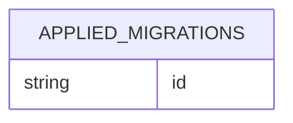

<!-- superdev:generated source=ENT-0016 revision=1255 hash=da75246c2df09cbdbd3e1e243c1b4c7d6728f3151de3713c9aae8754ce4d89dc -->
# Entity: applied_migrations

- **Status:** Specified
- **Owning module:** Decisions, Changes, and Questions
- **Store:** project database
- **Schema source:** docs/prd.md section 14.1
- **Sensitivity:** none
- **Last verified:** see the generation marker at the top of this file.

## Purpose

The applied migrations table. The requirements document calls this "migrations".

## Fields

| Field | Type | Null | Default | Constraints | Sensitivity |
|---|---|---|---|---|---|
| version | integer | y | - | none | none |
| name | text | n | - | none | none |
| checksum | text | n | - | none | none |
| applied_at | text | n | - | none | none |

## Relationships

No relationships recorded.

## Lifecycle

- **Created by:** no operation recorded
- **Read or updated by:** no operation recorded
- **Deleted:** Not recorded
- **Retention:** none declared

## Indexes and uniqueness

- None recorded. The schema source outranks this prose.

## Migration notes

No migrations affect this entity.
