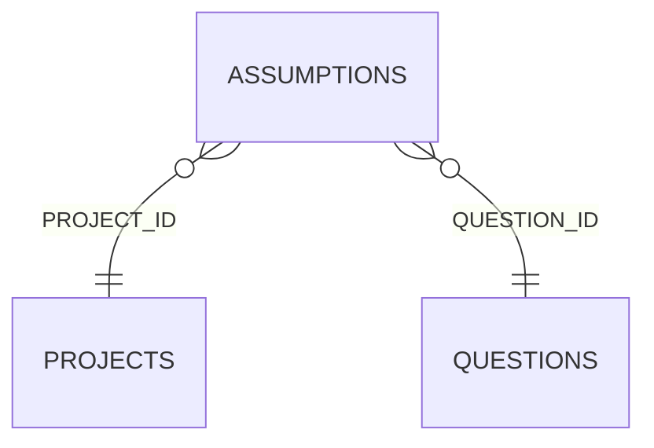

<!-- superdev:generated source=ENT-0034 revision=2087 hash=6643d901e7ca15693fc37b16110ae6a4783bba25c34b6ff7a629274ef1022a77 -->
# Entity: assumptions

- **Status:** Specified
- **Owning module:** Decisions, Changes, and Questions
- **Store:** project database
- **Schema source:** src/db/migrations
- **Sensitivity:** none
- **Last verified:** see the generation marker at the top of this file.

## Purpose

A reversible answer used temporarily in place of a resolved question.

## Fields

| Field | Type | Null | Default | Constraints | Sensitivity |
|---|---|---|---|---|---|
| id | text | y | - | none | none |
| project_id | text | n | - | none | none |
| statement | text | n | - | none | none |
| why_assumed | text | n | - | none | none |
| review_trigger | text | n | - | none | none |
| consequence_if_wrong | text | y | - | none | none |
| scope_type | text | y | - | none | none |
| scope_id | text | y | - | none | none |
| question_id | text | y | - | none | none |
| status | text | n | 'holding' | none | none |
| resolved_by | text | y | - | none | none |
| resolved_at | text | y | - | none | none |
| resolution | text | y | - | none | none |
| created_at | text | n | - | none | none |
| updated_at | text | n | - | none | none |
| version | integer | n | 1 | none | none |

## Relationships

| Relation | Direction | Target | Cardinality | On delete | Ownership |
|---|---|---|---|---|---|
| project_id | outgoing | projects | n:1 | cascade | assumptions.project_id references projects.id. |
| question_id | outgoing | questions | n:1 | set_null | assumptions.question_id references questions.id. |

## Lifecycle

- **Created by:** no operation recorded
- **Read or updated by:** no operation recorded
- **Deleted:** Not recorded
- **Retention:** none declared

## Indexes and uniqueness

- None recorded. The schema source outranks this prose.

## Migration notes

| Migration | Forward | Rollback | Compatibility | Status |
|---|---|---|---|---|
| 008_changes_assumptions_test_plans_api_services.sql | Creates 6 tables and alters 1. Tables touched: changes, change_targets, assumptions, test_plans, test_plan_cases, api_services, api_operations. | Restore the backup taken immediately before this migration ran. The runner writes one with VACUUM INTO before applying anything, and prints its path. There is no down migration: section 12.3 requires ordered migration files and forbids direct schema push, and a reversal written by hand would be a second unversioned path. | Recorded checksum 038b409ed83caa66. The migrations validator rebuilds the schema from every file and reports drift if this file changes after being applied. | Applied |
