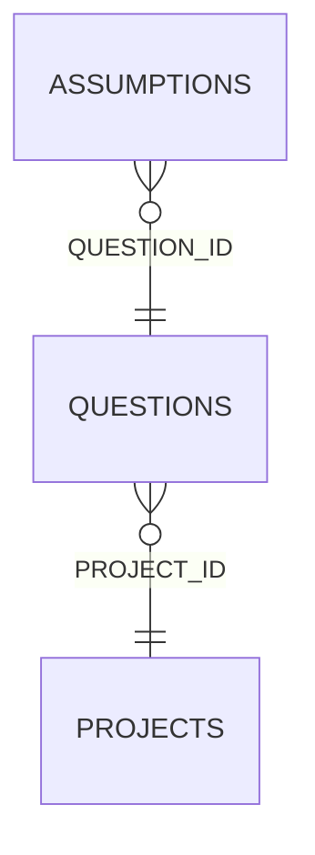

<!-- superdev:generated source=ENT-0033 revision=2087 hash=256bea19bcc6588e9cf580f68a7e6cd60b4d3b97306b6afa59881430e25a57fe -->
# Entity: questions

- **Status:** Specified
- **Owning module:** Decisions, Changes, and Questions
- **Store:** project database
- **Schema source:** docs/prd.md section 14.1
- **Sensitivity:** none
- **Last verified:** see the generation marker at the top of this file.

## Purpose

An unresolved product or technical choice.

## Fields

| Field | Type | Null | Default | Constraints | Sensitivity |
|---|---|---|---|---|---|
| id | text | y | - | none | none |
| project_id | text | n | - | none | none |
| scope_type | text | n | - | none | none |
| scope_id | text | y | - | none | none |
| question | text | n | - | none | none |
| why_it_matters | text | n | - | none | none |
| recommendation | text | y | - | none | none |
| alternatives_json | text | n | '[]' | none | none |
| status | text | n | 'open' | none | none |
| answer | text | y | - | none | none |
| answered_by | text | y | - | none | none |
| answered_at | text | y | - | none | none |
| deferral_reason | text | y | - | none | none |
| created_at | text | n | - | none | none |
| version | integer | n | 1 | none | none |

## Relationships

| Relation | Direction | Target | Cardinality | On delete | Ownership |
|---|---|---|---|---|---|
| project_id | outgoing | projects | n:1 | cascade | questions.project_id references projects.id. |
| question_id | incoming | assumptions | n:1 | set_null | assumptions.question_id references questions.id. |

## Lifecycle

- **Created by:** no operation recorded
- **Read or updated by:** superdev question list
- **Deleted:** Not recorded
- **Retention:** none declared

## Indexes and uniqueness

- None recorded. The schema source outranks this prose.

## Migration notes

| Migration | Forward | Rollback | Compatibility | Status |
|---|---|---|---|---|
| 001_initial.sql | Creates 58 tables and alters 0. Tables touched: projects, source_material, discovery_items, discovery_links, questions, goals, goal_success_criteria, milestones, modules, features. | Restore the backup taken immediately before this migration ran. The runner writes one with VACUUM INTO before applying anything, and prints its path. There is no down migration: section 12.3 requires ordered migration files and forbids direct schema push, and a reversal written by hand would be a second unversioned path. | Recorded checksum 685c01b253bea226. The migrations validator rebuilds the schema from every file and reports drift if this file changes after being applied. | Applied |
