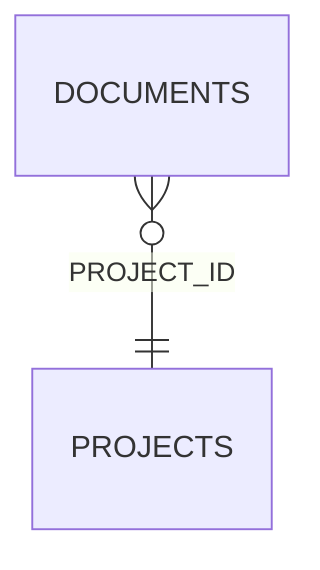

<!-- superdev:generated source=ENT-0039 revision=2087 hash=ffcc958afa5301e6f4a8648ca02c814bcd0f9bc8a41af1431f9d11706da4cfbe -->
# Entity: documents

- **Status:** Specified
- **Owning module:** Documentation Generation and Sync
- **Store:** project database
- **Schema source:** docs/prd.md section 14.1
- **Sensitivity:** none
- **Last verified:** see the generation marker at the top of this file.

## Purpose

Generated documents, and the state of any hand edit to one. A pending edit is documents.sync_status set to manual_edit_pending, so a proposal is a state on the document rather than a record of its own.

## Fields

| Field | Type | Null | Default | Constraints | Sensitivity |
|---|---|---|---|---|---|
| id | text | y | - | none | none |
| project_id | text | n | - | none | none |
| kind | text | n | - | none | none |
| scope_type | text | n | - | none | none |
| scope_id | text | y | - | none | none |
| path | text | n | - | none | none |
| template | text | y | - | none | none |
| database_revision | integer | n | 0 | none | none |
| generated_body | text | y | - | none | none |
| generated_hash | text | y | - | none | secret |
| manual_hash | text | y | - | none | secret |
| sync_status | text | n | 'generated' | none | none |
| generated_at | text | y | - | none | none |
| regeneration_mode | text | n | 'authored_projection' | none | none |
| source_fingerprint | text | y | - | none | none |

## Relationships

| Relation | Direction | Target | Cardinality | On delete | Ownership |
|---|---|---|---|---|---|
| project_id | outgoing | projects | n:1 | cascade | documents.project_id references projects.id. |

## Lifecycle

- **Created by:** no operation recorded
- **Read or updated by:** no operation recorded
- **Deleted:** Not recorded
- **Retention:** none declared

## Indexes and uniqueness

- None recorded. The schema source outranks this prose.

## Migration notes

| Migration | Forward | Rollback | Compatibility | Status |
|---|---|---|---|---|
| 001_initial.sql | Creates 58 tables and alters 0. Tables touched: projects, source_material, discovery_items, discovery_links, questions, goals, goal_success_criteria, milestones, modules, features. | Restore the backup taken immediately before this migration ran. The runner writes one with VACUUM INTO before applying anything, and prints its path. There is no down migration: section 12.3 requires ordered migration files and forbids direct schema push, and a reversal written by hand would be a second unversioned path. | Recorded checksum 685c01b253bea226. The migrations validator rebuilds the schema from every file and reports drift if this file changes after being applied. | Applied |
| 002_docs_coverage.sql | Creates 6 tables and alters 4. Tables touched: project_scope_items, glossary_terms, runtime_pieces, runtime_piece_edges, decision_links, capability_areas_v2, decisions, roles, documents. | Restore the backup taken immediately before this migration ran. The runner writes one with VACUUM INTO before applying anything, and prints its path. There is no down migration: section 12.3 requires ordered migration files and forbids direct schema push, and a reversal written by hand would be a second unversioned path. | Recorded checksum 4e7f28afe6bee99d. The migrations validator rebuilds the schema from every file and reports drift if this file changes after being applied. | Applied |
