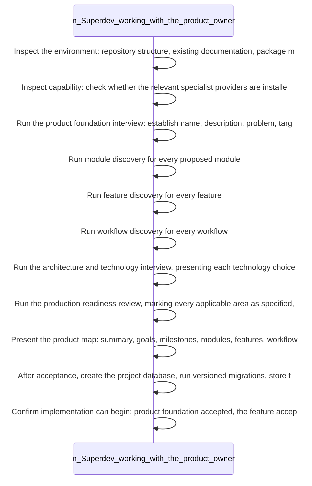

<!-- superdev:generated source=WF-0001 revision=681 hash=325650e4fd8a449c265376d46e4322c3dff1bdbc625c69f3cc466c617e8c7aa3 -->
# Onboarding Journey

- **Status:** Specified
- **Module:** Documentation Generation and Sync
- **Feature:** Generate documentation from the accepted model
- **Last verified:** see the generation marker at the top of this file.

## Workflow

- **Purpose:** An accepted product model exists, provider gaps are disclosed, the project database and documentation are created, and the first task is ready to implement
- **Actors:** none recorded
- **Trigger:** The owner runs superdev init (empty repo, idea only, or scaffold without product requirements) or superdev adopt (existing codebase that needs a reverse engineered product model)
- **Preconditions:** none recorded

| Step | Owner | Action | Input | Expected result | On failure |
|---|---|---|---|---|---|
| 1 | Superdev, working with the product owner | Inspect the environment: repository structure, existing documentation, package manifests, frameworks, database tooling, migration files, APIs, UI routes, authentication, integrations, tests, deployment configuration, existing agent instructions, and current git status | - | Everything discoverable from the codebase is known without asking the owner for it | - |
| 2 | Superdev, working with the product owner | Inspect capability: check whether the relevant specialist providers are installed, invocable, compatible with the harness, trusted where required, and at a known version | - | Available providers are confirmed usable; missing ones are reported with purpose, impact, install plan, and required consent | No provider is installed silently |
| 3 | Superdev, working with the product owner | Run the product foundation interview: establish name, description, problem, target users, roles, expected outcomes, business model, platforms, constraints, risks, success metrics, non-goals, and release expectations | - | The product foundation is established | - |
| 4 | Superdev, working with the product owner | Run module discovery for every proposed module | - | Each module has its responsibility, scope, dependencies, data, APIs, UI surfaces, integrations, permissions, failure handling, non-functional requirements, and test and deployment approach defined | - |
| 5 | Superdev, working with the product owner | Run feature discovery for every feature | - | Each feature has its problem, outcome, actors, paths, acceptance criteria, and delivery details defined | - |
| 6 | Superdev, working with the product owner | Run workflow discovery for every workflow | - | Each workflow has its trigger, actor, preconditions, ordered steps, decision points, and completion condition defined | - |
| 7 | Superdev, working with the product owner | Run the architecture and technology interview, presenting each technology choice with a recommended option, alternatives, benefits, risks, operational cost, lock-in, and reversibility | - | Architecture and technology stack decisions are made by the owner | - |
| 8 | Superdev, working with the product owner | Run the production readiness review, marking every applicable area as specified, awaiting decision, not applicable with reason, or deferred with owner, trigger, and consequence | - | Readiness state is known for every area, none left silently unaddressed | - |
| 9 | Superdev, working with the product owner | Present the product map: summary, goals, milestones, modules, features, workflows, architecture, stack, data model, APIs, integrations, decisions, open questions, risks, delivery order, and first implementation slice | - | The owner accepts the plan or requests changes | If the owner requests changes, Superdev revises the plan and presents it again before implementation starts |
| 10 | Superdev, working with the product owner | After acceptance, create the project database, run versioned migrations, store the accepted product model, generate docs skill artifacts, confirm database and document parity, derive implementation tasks, open the local control center, and present the first ready task | - | The project is documented, tracked in the database, and has a ready first task | - |
| 11 | Superdev, working with the product owner | Confirm implementation can begin: product foundation accepted, the feature accepted, the task belongs to that feature, the task links to an accepted contract, dependencies satisfied, material questions answered or explicitly assumed, and verification requirements known | - | Implementation starts only once every gating condition is true | - |

- **Completion:** An accepted product model exists, provider gaps are disclosed, the project database and documentation are created, and the first task is ready to implement
- **Observability:** Not recorded

No branches recorded. A workflow with no alternate path is either trivial or unfinished.

