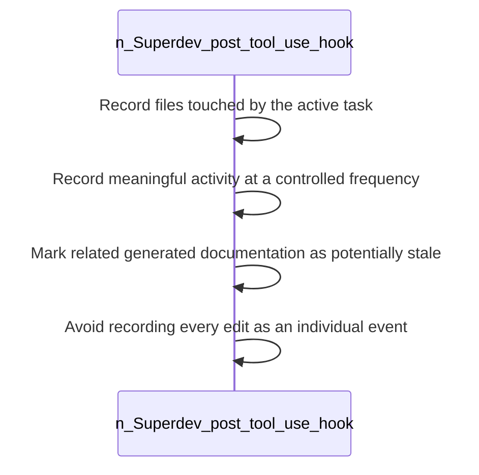

<!-- superdev:generated source=WF-0007 revision=681 hash=d63258de5ea2fb8834437356dd8eace73868a5903833f490c02b95199ccfe202 -->
# Post Tool Use Hook

- **Status:** Specified
- **Module:** Documentation Generation and Sync
- **Feature:** Flag stale documentation after changes
- **Last verified:** see the generation marker at the top of this file.

## Workflow

- **Purpose:** Task activity and documentation staleness are tracked at a controlled frequency after each tool use
- **Actors:** none recorded
- **Trigger:** A tool call by the agent completes
- **Preconditions:** none recorded

| Step | Owner | Action | Input | Expected result | On failure |
|---|---|---|---|---|---|
| 1 | Superdev (post tool use hook) | Record files touched by the active task | - | The task's file footprint is tracked | - |
| 2 | Superdev (post tool use hook) | Record meaningful activity at a controlled frequency | - | The activity log stays useful rather than noisy | - |
| 3 | Superdev (post tool use hook) | Mark related generated documentation as potentially stale | - | Stale docs are flagged for refresh | - |
| 4 | Superdev (post tool use hook) | Avoid recording every edit as an individual event | - | The log is not flooded by micro edits | - |

- **Completion:** Task activity and documentation staleness are tracked at a controlled frequency after each tool use
- **Observability:** Not recorded

No branches recorded. A workflow with no alternate path is either trivial or unfinished.

