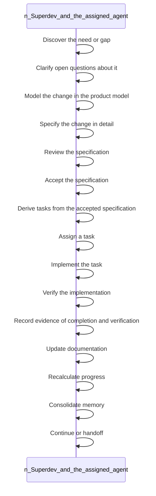

<!-- superdev:generated source=WF-0002 revision=681 hash=c3b626a2a7a20a1af37eb30f454ef2128c17a186047d9f4c769ed06abddea065 -->
# Product Development Lifecycle

- **Status:** Specified
- **Module:** Documentation Generation and Sync
- **Feature:** Generate documentation from the accepted model
- **Last verified:** see the generation marker at the top of this file.

## Workflow

- **Purpose:** The change is discovered, specified, accepted, implemented, verified, and reflected in documentation, progress, and memory
- **Actors:** none recorded
- **Trigger:** A product need, gap, or requested change is identified
- **Preconditions:** none recorded

| Step | Owner | Action | Input | Expected result | On failure |
|---|---|---|---|---|---|
| 1 | Superdev and the assigned agent | Discover the need or gap | - | The need is identified and captured | - |
| 2 | Superdev and the assigned agent | Clarify open questions about it | - | Ambiguity is resolved or recorded as an explicit assumption | - |
| 3 | Superdev and the assigned agent | Model the change in the product model | - | Modules, features, workflows, or data reflect the proposed change | - |
| 4 | Superdev and the assigned agent | Specify the change in detail | - | A ready to review specification exists | - |
| 5 | Superdev and the assigned agent | Review the specification | - | Gaps or errors are found and addressed before acceptance | - |
| 6 | Superdev and the assigned agent | Accept the specification | - | The specification becomes binding project truth | - |
| 7 | Superdev and the assigned agent | Derive tasks from the accepted specification | - | Tasks exist and are linked back to the specification | - |
| 8 | Superdev and the assigned agent | Assign a task | - | A task is claimed and owned by an agent | - |
| 9 | Superdev and the assigned agent | Implement the task | - | The task's contract is built | - |
| 10 | Superdev and the assigned agent | Verify the implementation | - | Required tests and checks pass, or failures surface | - |
| 11 | Superdev and the assigned agent | Record evidence of completion and verification | - | Proof is stored against the task | - |
| 12 | Superdev and the assigned agent | Update documentation | - | Generated docs match the implemented change | - |
| 13 | Superdev and the assigned agent | Recalculate progress | - | Reported feature, module, and project progress reflects actual state | - |
| 14 | Superdev and the assigned agent | Consolidate memory | - | Durable memory absorbs what was learned in the session | - |
| 15 | Superdev and the assigned agent | Continue or handoff | - | The next unit of work has a clear owner | - |

- **Completion:** The change is discovered, specified, accepted, implemented, verified, and reflected in documentation, progress, and memory
- **Observability:** Not recorded

No branches recorded. A workflow with no alternate path is either trivial or unfinished.

