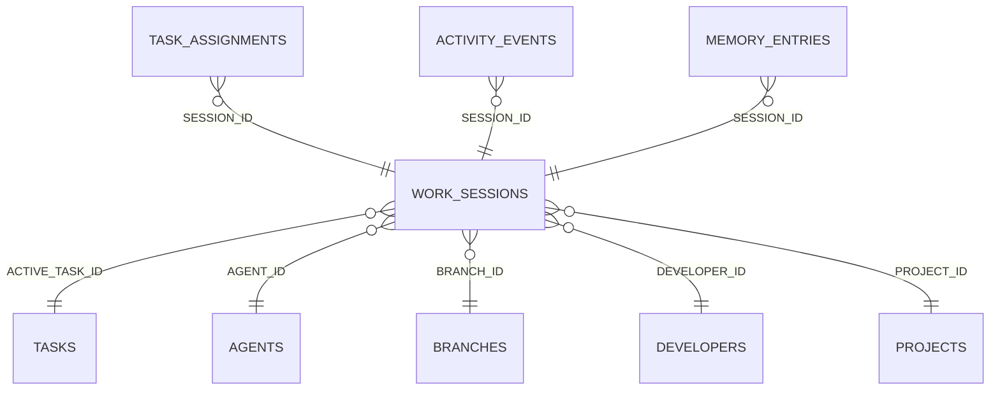

<!-- superdev:generated source=ENT-0031 revision=2087 hash=1bb9a918a9b9160d8c0b23d31c27ee77126f6fe3383ef0694b3461ea3ac035d1 -->
# Entity: work_sessions

- **Status:** Specified
- **Owning module:** Hooks and Session Continuity
- **Store:** project database
- **Schema source:** docs/prd.md section 14.1
- **Sensitivity:** none
- **Last verified:** see the generation marker at the top of this file.

## Purpose

A bounded period of agent or developer activity.

## Fields

| Field | Type | Null | Default | Constraints | Sensitivity |
|---|---|---|---|---|---|
| id | text | y | - | none | none |
| project_id | text | n | - | none | none |
| developer_id | text | y | - | none | none |
| agent_id | text | y | - | none | none |
| branch_id | text | y | - | none | none |
| active_task_id | text | y | - | none | none |
| objective | text | y | - | none | none |
| started_at | text | n | - | none | none |
| last_activity_at | text | y | - | none | none |
| ended_at | text | y | - | none | none |
| outcome | text | y | - | none | none |
| handoff | text | y | - | none | none |
| next_action | text | y | - | none | none |
| status | text | n | 'active' | none | none |

## Relationships

| Relation | Direction | Target | Cardinality | On delete | Ownership |
|---|---|---|---|---|---|
| active_task_id | outgoing | tasks | n:1 | set_null | work_sessions.active_task_id references tasks.id. |
| agent_id | outgoing | agents | n:1 | set_null | work_sessions.agent_id references agents.id. |
| branch_id | outgoing | branches | n:1 | set_null | work_sessions.branch_id references branches.id. |
| developer_id | outgoing | developers | n:1 | set_null | work_sessions.developer_id references developers.id. |
| project_id | outgoing | projects | n:1 | cascade | work_sessions.project_id references projects.id. |
| session_id | incoming | task_assignments | n:1 | set_null | task_assignments.session_id references work_sessions.id. |
| session_id | incoming | activity_events | n:1 | set_null | activity_events.session_id references work_sessions.id. |
| session_id | incoming | memory_entries | n:1 | set_null | memory_entries.session_id references work_sessions.id. |

## Lifecycle

- **Created by:** no operation recorded
- **Read or updated by:** no operation recorded
- **Deleted:** Not recorded
- **Retention:** none declared

## Indexes and uniqueness

- None recorded. The schema source outranks this prose.

## Migration notes

| Migration | Forward | Rollback | Compatibility | Status |
|---|---|---|---|---|
| 001_initial.sql | Creates 58 tables and alters 0. Tables touched: projects, source_material, discovery_items, discovery_links, questions, goals, goal_success_criteria, milestones, modules, features. | Restore the backup taken immediately before this migration ran. The runner writes one with VACUUM INTO before applying anything, and prints its path. There is no down migration: section 12.3 requires ordered migration files and forbids direct schema push, and a reversal written by hand would be a second unversioned path. | Recorded checksum 685c01b253bea226. The migrations validator rebuilds the schema from every file and reports drift if this file changes after being applied. | Applied |
