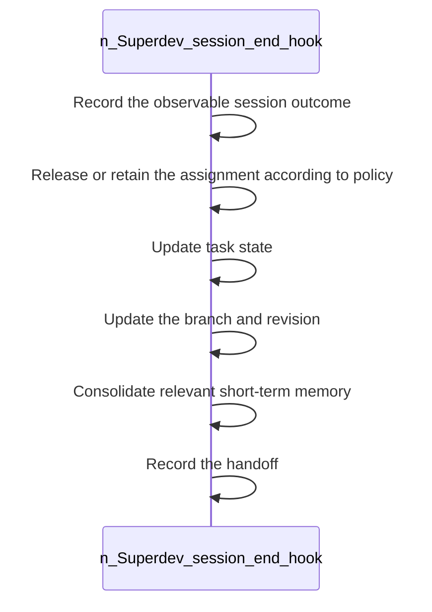

<!-- superdev:generated source=WF-0009 revision=681 hash=c3a1c86d06b862c31a150b80aef7495a70faf7342c962365c1239c8ec3f05278 -->
# Session End Hook

- **Status:** Specified
- **Module:** Hooks and Session Continuity
- **Feature:** Record session outcome at session end
- **Last verified:** see the generation marker at the top of this file.

## Workflow

- **Purpose:** The session closes with outcome, task state, branch, memory, and handoff all recorded
- **Actors:** none recorded
- **Trigger:** The session ends
- **Preconditions:** none recorded

| Step | Owner | Action | Input | Expected result | On failure |
|---|---|---|---|---|---|
| 1 | Superdev (session end hook) | Record the observable session outcome | - | The outcome of the session is captured | - |
| 2 | Superdev (session end hook) | Release or retain the assignment according to policy | - | Task ownership is settled correctly | - |
| 3 | Superdev (session end hook) | Update task state | - | Task state reflects the session's end | - |
| 4 | Superdev (session end hook) | Update the branch and revision | - | The code location is recorded | - |
| 5 | Superdev (session end hook) | Consolidate relevant short-term memory | - | Durable memory absorbs the session's short-term memory | - |
| 6 | Superdev (session end hook) | Record the handoff | - | The next session or agent can pick up cleanly | - |

- **Completion:** The session closes with outcome, task state, branch, memory, and handoff all recorded
- **Observability:** Not recorded

No branches recorded. A workflow with no alternate path is either trivial or unfinished.

