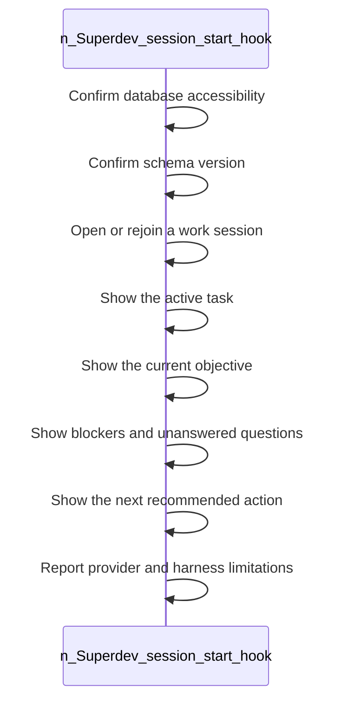

<!-- superdev:generated source=WF-0005 revision=681 hash=311f4eed8cbf032ab25c612bfa8e53e6687493957113a4018ec83d6e8940915e -->
# Session Start Hook

- **Status:** Specified
- **Module:** Hooks and Session Continuity
- **Feature:** Restore context at session start
- **Last verified:** see the generation marker at the top of this file.

## Workflow

- **Purpose:** The session opens with the active task, objective, blockers, next action, and any limitations disclosed
- **Actors:** none recorded
- **Trigger:** A new session begins or an existing one is rejoined
- **Preconditions:** none recorded

| Step | Owner | Action | Input | Expected result | On failure |
|---|---|---|---|---|---|
| 1 | Superdev (session start hook) | Confirm database accessibility | - | The database is confirmed reachable | If hooks are unsupported in the current harness, the same checks remain reachable through superdev resume and explicit commands |
| 2 | Superdev (session start hook) | Confirm schema version | - | The schema is confirmed current and compatible | - |
| 3 | Superdev (session start hook) | Open or rejoin a work session | - | An active work session exists for the agent | - |
| 4 | Superdev (session start hook) | Show the active task | - | The current task is visible | - |
| 5 | Superdev (session start hook) | Show the current objective | - | What is being worked toward is visible | - |
| 6 | Superdev (session start hook) | Show blockers and unanswered questions | - | Known blockers are visible | - |
| 7 | Superdev (session start hook) | Show the next recommended action | - | The agent knows what to do next | - |
| 8 | Superdev (session start hook) | Report provider and harness limitations | - | Any missing capability is disclosed upfront | - |

- **Completion:** The session opens with the active task, objective, blockers, next action, and any limitations disclosed
- **Observability:** Not recorded

No branches recorded. A workflow with no alternate path is either trivial or unfinished.

