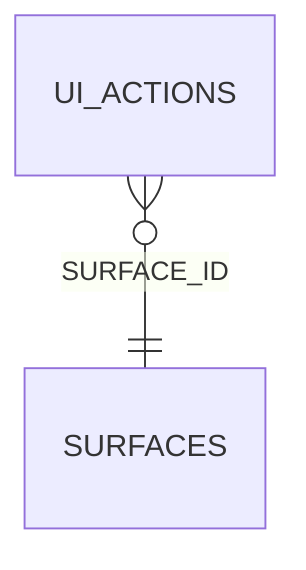

<!-- superdev:generated source=ENT-0010 revision=2087 hash=832c3b630cf1a30ddbe9c51b0002d68ae23484c08bf42f4fc9359ff0bc8227b6 -->
# Entity: ui_actions

- **Status:** Specified
- **Owning module:** Local Control Center
- **Store:** project database
- **Schema source:** docs/prd.md section 14.1
- **Sensitivity:** none
- **Last verified:** see the generation marker at the top of this file.

## Purpose

A button, form, command, or state transition on a UI surface.

## Fields

| Field | Type | Null | Default | Constraints | Sensitivity |
|---|---|---|---|---|---|
| id | text | y | - | none | none |
| surface_id | text | n | - | none | none |
| name | text | n | - | none | none |
| label | text | y | - | none | none |
| trigger | text | y | - | none | none |
| role | text | y | - | none | none |
| permission | text | y | - | none | none |
| enforcement_point | text | y | - | none | none |
| precondition | text | y | - | none | none |
| effect | text | y | - | none | none |
| input_contract | text | y | - | none | none |
| validation | text | y | - | none | none |
| side_effects_json | text | n | '[]' | none | none |
| confirmation | text | y | - | none | none |
| loading_behavior | text | y | - | none | none |
| disabled_behavior | text | y | - | none | none |
| success_behavior | text | y | - | none | none |
| error_behavior | text | y | - | none | none |
| keyboard | text | y | - | none | secret |
| accessible_name | text | y | - | none | none |
| focus_behavior | text | y | - | none | none |
| status | text | n | 'draft' | none | none |
| created_at | text | n | - | none | none |
| updated_at | text | n | - | none | none |
| version | integer | n | 1 | none | none |

## Relationships

| Relation | Direction | Target | Cardinality | On delete | Ownership |
|---|---|---|---|---|---|
| surface_id | outgoing | surfaces | n:1 | cascade | ui_actions.surface_id references surfaces.id. |

## Lifecycle

- **Created by:** no operation recorded
- **Read or updated by:** no operation recorded
- **Deleted:** Not recorded
- **Retention:** none declared

## Indexes and uniqueness

- None recorded. The schema source outranks this prose.

## Migration notes

| Migration | Forward | Rollback | Compatibility | Status |
|---|---|---|---|---|
| 001_initial.sql | Creates 58 tables and alters 0. Tables touched: projects, source_material, discovery_items, discovery_links, questions, goals, goal_success_criteria, milestones, modules, features. | Restore the backup taken immediately before this migration ran. The runner writes one with VACUUM INTO before applying anything, and prints its path. There is no down migration: section 12.3 requires ordered migration files and forbids direct schema push, and a reversal written by hand would be a second unversioned path. | Recorded checksum 685c01b253bea226. The migrations validator rebuilds the schema from every file and reports drift if this file changes after being applied. | Applied |
