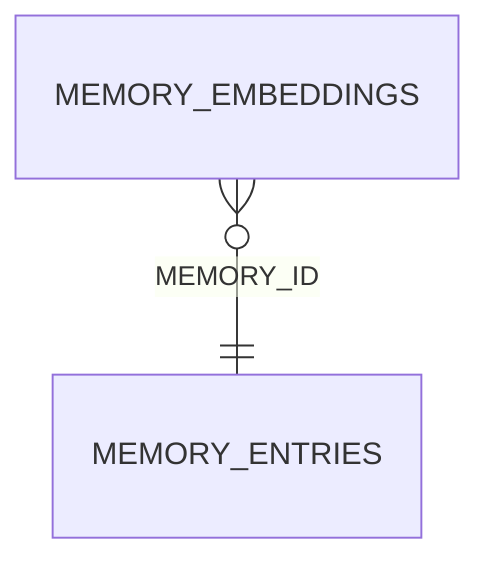

<!-- superdev:generated source=ENT-0044 revision=2087 hash=046c8d95000a654e48f6adbad954653fce011ff1123c6826aa23fc06ceb2cabb -->
# Entity: memory_embeddings

- **Status:** Specified
- **Owning module:** Memory System
- **Store:** project database
- **Schema source:** docs/prd.md section 14.1
- **Sensitivity:** none
- **Last verified:** see the generation marker at the top of this file.

## Purpose

An optional vector embedding of a memory entry for similarity search.

## Fields

| Field | Type | Null | Default | Constraints | Sensitivity |
|---|---|---|---|---|---|
| memory_id | text | n | - | none | none |
| provider | text | n | - | none | none |
| model | text | n | - | none | none |
| dimensions | integer | n | - | none | none |
| content_hash | text | n | - | none | secret |
| embedding | blob | y | - | none | none |
| generated_at | text | y | - | none | none |
| status | text | n | 'pending' | none | none |

## Relationships

| Relation | Direction | Target | Cardinality | On delete | Ownership |
|---|---|---|---|---|---|
| memory_id | outgoing | memory_entries | n:1 | cascade | memory_embeddings.memory_id references memory_entries.id. |

## Lifecycle

- **Created by:** no operation recorded
- **Read or updated by:** no operation recorded
- **Deleted:** Not recorded
- **Retention:** none declared

## Indexes and uniqueness

- None recorded. The schema source outranks this prose.

## Migration notes

| Migration | Forward | Rollback | Compatibility | Status |
|---|---|---|---|---|
| 003_memory_retrieval_and_integrity.sql | Creates 3 tables and alters 2. Tables touched: memory_search_terms, memory_links_v2, memory_embeddings, memory_entries. | Restore the backup taken immediately before this migration ran. The runner writes one with VACUUM INTO before applying anything, and prints its path. There is no down migration: section 12.3 requires ordered migration files and forbids direct schema push, and a reversal written by hand would be a second unversioned path. | Recorded checksum 9cc657fd588cb8ed. The migrations validator rebuilds the schema from every file and reports drift if this file changes after being applied. | Applied |
