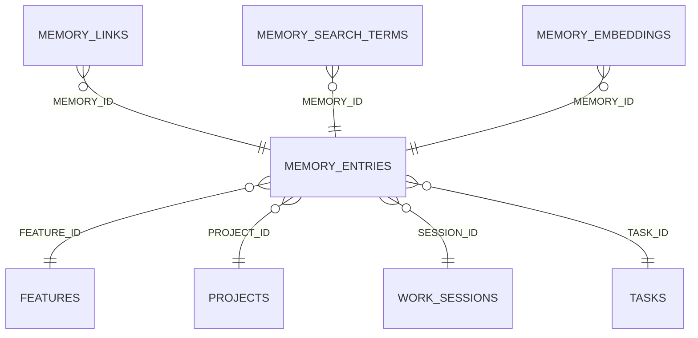

<!-- superdev:generated source=ENT-0041 revision=2087 hash=64e931020a054a86e1df129147a0a09968267121053cb9a812c160787e9b0c50 -->
# Entity: memory_entries

- **Status:** Specified
- **Owning module:** Memory System
- **Store:** project database
- **Schema source:** docs/prd.md section 14.1
- **Sensitivity:** none
- **Last verified:** see the generation marker at the top of this file.

## Purpose

Verified or unverified recall from previous work.

## Fields

| Field | Type | Null | Default | Constraints | Sensitivity |
|---|---|---|---|---|---|
| id | text | y | - | none | none |
| project_id | text | n | - | none | none |
| session_id | text | y | - | none | none |
| task_id | text | y | - | none | none |
| feature_id | text | y | - | none | none |
| kind | text | n | - | none | none |
| title | text | n | - | none | none |
| content | text | n | - | none | none |
| source_ref | text | y | - | none | none |
| epistemic_status | text | n | 'inferred' | none | none |
| embedding | blob | y | - | none | none |
| created_at | text | n | - | none | none |
| superseded_by | text | y | - | none | none |
| version | integer | n | 1 | none | none |
| dedupe_key | text | y | - | none | secret |
| source_event_id | text | y | - | none | none |
| content_hash | text | y | - | none | secret |

## Relationships

| Relation | Direction | Target | Cardinality | On delete | Ownership |
|---|---|---|---|---|---|
| feature_id | outgoing | features | n:1 | set_null | memory_entries.feature_id references features.id. |
| project_id | outgoing | projects | n:1 | cascade | memory_entries.project_id references projects.id. |
| session_id | outgoing | work_sessions | n:1 | set_null | memory_entries.session_id references work_sessions.id. |
| task_id | outgoing | tasks | n:1 | set_null | memory_entries.task_id references tasks.id. |
| memory_id | incoming | memory_links | n:1 | cascade | memory_links.memory_id references memory_entries.id. |
| memory_id | incoming | memory_search_terms | n:1 | cascade | memory_search_terms.memory_id references memory_entries.id. |
| memory_id | incoming | memory_embeddings | n:1 | cascade | memory_embeddings.memory_id references memory_entries.id. |

## Lifecycle

- **Created by:** no operation recorded
- **Read or updated by:** no operation recorded
- **Deleted:** Not recorded
- **Retention:** none declared

## Indexes and uniqueness

- None recorded. The schema source outranks this prose.

## Migration notes

| Migration | Forward | Rollback | Compatibility | Status |
|---|---|---|---|---|
| 001_initial.sql | Creates 58 tables and alters 0. Tables touched: projects, source_material, discovery_items, discovery_links, questions, goals, goal_success_criteria, milestones, modules, features. | Restore the backup taken immediately before this migration ran. The runner writes one with VACUUM INTO before applying anything, and prints its path. There is no down migration: section 12.3 requires ordered migration files and forbids direct schema push, and a reversal written by hand would be a second unversioned path. | Recorded checksum 685c01b253bea226. The migrations validator rebuilds the schema from every file and reports drift if this file changes after being applied. | Applied |
| 003_memory_retrieval_and_integrity.sql | Creates 3 tables and alters 2. Tables touched: memory_search_terms, memory_links_v2, memory_embeddings, memory_entries. | Restore the backup taken immediately before this migration ran. The runner writes one with VACUUM INTO before applying anything, and prints its path. There is no down migration: section 12.3 requires ordered migration files and forbids direct schema push, and a reversal written by hand would be a second unversioned path. | Recorded checksum 9cc657fd588cb8ed. The migrations validator rebuilds the schema from every file and reports drift if this file changes after being applied. | Applied |
