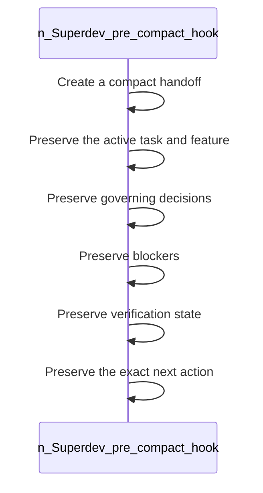

<!-- superdev:generated source=WF-0008 revision=681 hash=1bef68d657417f9a51e29320afbe8320d899e7ad247bb15b5dcdf0d289b01dc7 -->
# Pre-Compact Hook

- **Status:** Specified
- **Module:** Memory System
- **Feature:** Create a handoff before context compaction
- **Last verified:** see the generation marker at the top of this file.

## Workflow

- **Purpose:** A compact handoff preserves the active task, feature, decisions, blockers, verification state, and next action through compaction
- **Actors:** none recorded
- **Trigger:** The context is about to be compacted
- **Preconditions:** none recorded

| Step | Owner | Action | Input | Expected result | On failure |
|---|---|---|---|---|---|
| 1 | Superdev (pre-compact hook) | Create a compact handoff | - | A condensed record of the current state exists | - |
| 2 | Superdev (pre-compact hook) | Preserve the active task and feature | - | The current work identity survives compaction | - |
| 3 | Superdev (pre-compact hook) | Preserve governing decisions | - | Decisions remain known after compaction | - |
| 4 | Superdev (pre-compact hook) | Preserve blockers | - | Open blockers are not lost | - |
| 5 | Superdev (pre-compact hook) | Preserve verification state | - | What has already been verified is not forgotten | - |
| 6 | Superdev (pre-compact hook) | Preserve the exact next action | - | Work can resume without re-deriving what to do next | - |

- **Completion:** A compact handoff preserves the active task, feature, decisions, blockers, verification state, and next action through compaction
- **Observability:** Not recorded

No branches recorded. A workflow with no alternate path is either trivial or unfinished.

