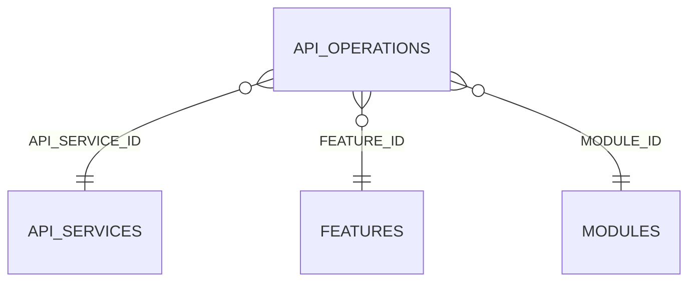

<!-- superdev:generated source=ENT-0012 revision=2087 hash=9d63ee50bc9a05bec0bff13b16453ffdfd46a765bbb7f7725db32bb3319ac0c7 -->
# Entity: api_operations

- **Status:** Specified
- **Owning module:** Product Model and Orchestration
- **Store:** project database
- **Schema source:** docs/prd.md section 14.1
- **Sensitivity:** none
- **Last verified:** see the generation marker at the top of this file.

## Purpose

A concrete endpoint, procedure, event, or command within an API service.

## Fields

| Field | Type | Null | Default | Constraints | Sensitivity |
|---|---|---|---|---|---|
| id | text | y | - | none | none |
| feature_id | text | y | - | none | none |
| module_id | text | n | - | none | none |
| name | text | n | - | none | none |
| style | text | n | 'rest' | none | none |
| method_or_procedure | text | y | - | none | none |
| path_or_topic | text | y | - | none | none |
| purpose | text | y | - | none | none |
| auth_requirement | text | y | - | none | none |
| permission | text | y | - | none | none |
| enforcement_point | text | y | - | none | none |
| request_contract_json | text | n | '{}' | none | none |
| response_contract_json | text | n | '{}' | none | none |
| error_contract_json | text | n | '[]' | none | none |
| idempotency | text | y | - | none | none |
| limits | text | y | - | none | none |
| side_effects_json | text | n | '[]' | none | none |
| versioning | text | y | - | none | none |
| implementation_path | text | y | - | none | none |
| status | text | n | 'draft' | none | none |
| created_at | text | n | - | none | none |
| updated_at | text | n | - | none | none |
| version | integer | n | 1 | none | none |
| api_service_id | text | y | - | none | none |

## Relationships

| Relation | Direction | Target | Cardinality | On delete | Ownership |
|---|---|---|---|---|---|
| api_service_id | outgoing | api_services | n:1 | set_null | api_operations.api_service_id references api_services.id. |
| feature_id | outgoing | features | n:1 | cascade | api_operations.feature_id references features.id. |
| module_id | outgoing | modules | n:1 | cascade | api_operations.module_id references modules.id. |

## Lifecycle

- **Created by:** no operation recorded
- **Read or updated by:** no operation recorded
- **Deleted:** Not recorded
- **Retention:** none declared

## Indexes and uniqueness

- None recorded. The schema source outranks this prose.

## Migration notes

| Migration | Forward | Rollback | Compatibility | Status |
|---|---|---|---|---|
| 001_initial.sql | Creates 58 tables and alters 0. Tables touched: projects, source_material, discovery_items, discovery_links, questions, goals, goal_success_criteria, milestones, modules, features. | Restore the backup taken immediately before this migration ran. The runner writes one with VACUUM INTO before applying anything, and prints its path. There is no down migration: section 12.3 requires ordered migration files and forbids direct schema push, and a reversal written by hand would be a second unversioned path. | Recorded checksum 685c01b253bea226. The migrations validator rebuilds the schema from every file and reports drift if this file changes after being applied. | Applied |
| 008_changes_assumptions_test_plans_api_services.sql | Creates 6 tables and alters 1. Tables touched: changes, change_targets, assumptions, test_plans, test_plan_cases, api_services, api_operations. | Restore the backup taken immediately before this migration ran. The runner writes one with VACUUM INTO before applying anything, and prints its path. There is no down migration: section 12.3 requires ordered migration files and forbids direct schema push, and a reversal written by hand would be a second unversioned path. | Recorded checksum 038b409ed83caa66. The migrations validator rebuilds the schema from every file and reports drift if this file changes after being applied. | Applied |
