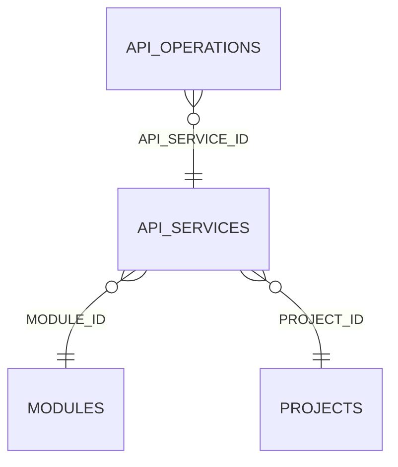

<!-- superdev:generated source=ENT-0011 revision=2087 hash=fa53cfb8dce1bf145d0606d6a35d958b6f051d405f65c2bdae9e57a880b2a265 -->
# Entity: api_services

- **Status:** Specified
- **Owning module:** Product Model and Orchestration
- **Store:** project database
- **Schema source:** src/db/migrations
- **Sensitivity:** none
- **Last verified:** see the generation marker at the top of this file.

## Purpose

A logical API boundary a feature can reference.

## Fields

| Field | Type | Null | Default | Constraints | Sensitivity |
|---|---|---|---|---|---|
| id | text | y | - | none | none |
| project_id | text | n | - | none | none |
| module_id | text | y | - | none | none |
| name | text | n | - | none | none |
| purpose | text | y | - | none | none |
| style | text | n | 'rest' | none | none |
| base_path | text | y | - | none | none |
| auth_requirement | text | y | - | none | none |
| versioning | text | y | - | none | none |
| status | text | n | 'specified' | none | none |
| sequence | integer | n | 0 | none | none |
| created_at | text | n | - | none | none |
| updated_at | text | n | - | none | none |
| version | integer | n | 1 | none | none |

## Relationships

| Relation | Direction | Target | Cardinality | On delete | Ownership |
|---|---|---|---|---|---|
| module_id | outgoing | modules | n:1 | set_null | api_services.module_id references modules.id. |
| project_id | outgoing | projects | n:1 | cascade | api_services.project_id references projects.id. |
| api_service_id | incoming | api_operations | n:1 | set_null | api_operations.api_service_id references api_services.id. |

## Lifecycle

- **Created by:** no operation recorded
- **Read or updated by:** no operation recorded
- **Deleted:** Not recorded
- **Retention:** none declared

## Indexes and uniqueness

- None recorded. The schema source outranks this prose.

## Migration notes

| Migration | Forward | Rollback | Compatibility | Status |
|---|---|---|---|---|
| 008_changes_assumptions_test_plans_api_services.sql | Creates 6 tables and alters 1. Tables touched: changes, change_targets, assumptions, test_plans, test_plan_cases, api_services, api_operations. | Restore the backup taken immediately before this migration ran. The runner writes one with VACUUM INTO before applying anything, and prints its path. There is no down migration: section 12.3 requires ordered migration files and forbids direct schema push, and a reversal written by hand would be a second unversioned path. | Recorded checksum 038b409ed83caa66. The migrations validator rebuilds the schema from every file and reports drift if this file changes after being applied. | Applied |
