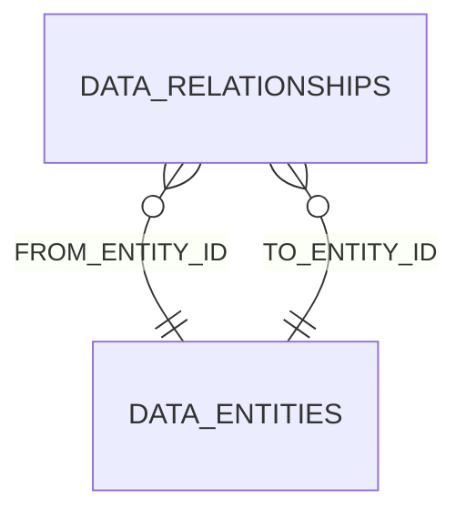

<!-- superdev:generated source=ENT-0015 revision=2087 hash=fa20b81eba388d326753559cfd357cfd29aa2f217333640ff87bf760a901625e -->
# Entity: data_relationships

- **Status:** Specified
- **Owning module:** Product Model and Orchestration
- **Store:** project database
- **Schema source:** docs/prd.md section 14.1
- **Sensitivity:** none
- **Last verified:** see the generation marker at the top of this file.

## Purpose

The data relationships table. The requirements document calls this "data relations".

## Fields

| Field | Type | Null | Default | Constraints | Sensitivity |
|---|---|---|---|---|---|
| id | text | y | - | none | none |
| from_entity_id | text | n | - | none | none |
| to_entity_id | text | n | - | none | none |
| name | text | n | - | none | none |
| cardinality | text | n | '1:n' | none | none |
| on_delete | text | y | - | none | none |
| ownership_note | text | y | - | none | none |

## Relationships

| Relation | Direction | Target | Cardinality | On delete | Ownership |
|---|---|---|---|---|---|
| from_entity_id | outgoing | data_entities | n:1 | cascade | data_relationships.from_entity_id references data_entities.id. |
| to_entity_id | outgoing | data_entities | n:1 | cascade | data_relationships.to_entity_id references data_entities.id. |

## Lifecycle

- **Created by:** no operation recorded
- **Read or updated by:** no operation recorded
- **Deleted:** Not recorded
- **Retention:** none declared

## Indexes and uniqueness

- None recorded. The schema source outranks this prose.

## Migration notes

| Migration | Forward | Rollback | Compatibility | Status |
|---|---|---|---|---|
| 001_initial.sql | Creates 58 tables and alters 0. Tables touched: projects, source_material, discovery_items, discovery_links, questions, goals, goal_success_criteria, milestones, modules, features. | Restore the backup taken immediately before this migration ran. The runner writes one with VACUUM INTO before applying anything, and prints its path. There is no down migration: section 12.3 requires ordered migration files and forbids direct schema push, and a reversal written by hand would be a second unversioned path. | Recorded checksum 685c01b253bea226. The migrations validator rebuilds the schema from every file and reports drift if this file changes after being applied. | Applied |
