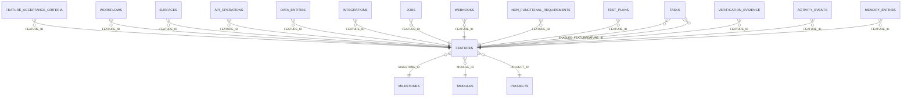

<!-- superdev:generated source=ENT-0005 revision=2087 hash=665396de40b1dd176436cc8b52e1253e60ec82d9c5cfab550ccc228d6cd696ed -->
# Entity: features

- **Status:** Specified
- **Owning module:** Product Model and Orchestration
- **Store:** project database
- **Schema source:** docs/prd.md section 14.1
- **Sensitivity:** none
- **Last verified:** see the generation marker at the top of this file.

## Purpose

A user-facing or system capability.

## Fields

| Field | Type | Null | Default | Constraints | Sensitivity |
|---|---|---|---|---|---|
| id | text | y | - | none | none |
| project_id | text | n | - | none | none |
| module_id | text | n | - | none | none |
| milestone_id | text | y | - | none | none |
| name | text | n | - | none | none |
| slug | text | n | - | none | none |
| purpose | text | y | - | none | none |
| user_statement | text | y | - | none | none |
| user_value | text | y | - | none | none |
| spec_depth | text | n | 'standard' | none | none |
| risk_level | text | n | 'R1' | none | none |
| scope_in_json | text | n | '[]' | none | none |
| scope_out_json | text | n | '[]' | none | none |
| status | text | n | 'draft' | none | none |
| priority | text | y | - | none | none |
| what_works_now | text | y | - | none | none |
| what_remains | text | y | - | none | none |
| next_action | text | y | - | none | none |
| accepted_at | text | y | - | none | none |
| created_at | text | n | - | none | none |
| updated_at | text | n | - | none | none |
| version | integer | n | 1 | none | none |

## Relationships

| Relation | Direction | Target | Cardinality | On delete | Ownership |
|---|---|---|---|---|---|
| milestone_id | outgoing | milestones | n:1 | set_null | features.milestone_id references milestones.id. |
| module_id | outgoing | modules | n:1 | restrict | features.module_id references modules.id. |
| project_id | outgoing | projects | n:1 | cascade | features.project_id references projects.id. |
| feature_id | incoming | feature_acceptance_criteria | n:1 | cascade | feature_acceptance_criteria.feature_id references features.id. |
| feature_id | incoming | workflows | n:1 | cascade | workflows.feature_id references features.id. |
| feature_id | incoming | surfaces | n:1 | cascade | surfaces.feature_id references features.id. |
| feature_id | incoming | api_operations | n:1 | cascade | api_operations.feature_id references features.id. |
| feature_id | incoming | data_entities | n:1 | set_null | data_entities.feature_id references features.id. |
| feature_id | incoming | integrations | n:1 | cascade | integrations.feature_id references features.id. |
| feature_id | incoming | jobs | n:1 | cascade | jobs.feature_id references features.id. |
| feature_id | incoming | webhooks | n:1 | cascade | webhooks.feature_id references features.id. |
| feature_id | incoming | non_functional_requirements | n:1 | cascade | non_functional_requirements.feature_id references features.id. |
| feature_id | incoming | test_plans | n:1 | cascade | test_plans.feature_id references features.id. |
| enabled_feature_id | incoming | tasks | n:1 | set_null | tasks.enabled_feature_id references features.id. |
| feature_id | incoming | tasks | n:1 | restrict | tasks.feature_id references features.id. |
| feature_id | incoming | verification_evidence | n:1 | cascade | verification_evidence.feature_id references features.id. |
| feature_id | incoming | activity_events | n:1 | set_null | activity_events.feature_id references features.id. |
| feature_id | incoming | memory_entries | n:1 | set_null | memory_entries.feature_id references features.id. |

## Lifecycle

- **Created by:** no operation recorded
- **Read or updated by:** superdev feature list
- **Deleted:** Not recorded
- **Retention:** none declared

## Indexes and uniqueness

- None recorded. The schema source outranks this prose.

## Migration notes

| Migration | Forward | Rollback | Compatibility | Status |
|---|---|---|---|---|
| 001_initial.sql | Creates 58 tables and alters 0. Tables touched: projects, source_material, discovery_items, discovery_links, questions, goals, goal_success_criteria, milestones, modules, features. | Restore the backup taken immediately before this migration ran. The runner writes one with VACUUM INTO before applying anything, and prints its path. There is no down migration: section 12.3 requires ordered migration files and forbids direct schema push, and a reversal written by hand would be a second unversioned path. | Recorded checksum 685c01b253bea226. The migrations validator rebuilds the schema from every file and reports drift if this file changes after being applied. | Applied |
