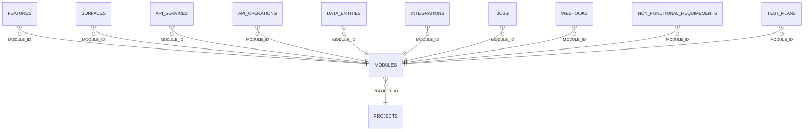

<!-- superdev:generated source=ENT-0004 revision=2087 hash=0f7aa2e4896da133bb24f62e90a87fe35aa7d8a528e02f3a3047f466f612b4a5 -->
# Entity: modules

- **Status:** Specified
- **Owning module:** Product Model and Orchestration
- **Store:** project database
- **Schema source:** docs/prd.md section 14.1
- **Sensitivity:** none
- **Last verified:** see the generation marker at the top of this file.

## Purpose

A coherent product or technical domain within a project.

## Fields

| Field | Type | Null | Default | Constraints | Sensitivity |
|---|---|---|---|---|---|
| id | text | y | - | none | none |
| project_id | text | n | - | none | none |
| name | text | n | - | none | none |
| slug | text | n | - | none | none |
| purpose | text | y | - | none | none |
| primary_users_json | text | n | '[]' | none | none |
| owns_json | text | n | '[]' | none | none |
| consumes_json | text | n | '[]' | none | none |
| status | text | n | 'planned' | none | none |
| sequence | integer | n | 0 | none | none |
| created_at | text | n | - | none | none |
| updated_at | text | n | - | none | none |
| version | integer | n | 1 | none | none |
| out_of_scope | text | y | - | none | none |

## Relationships

| Relation | Direction | Target | Cardinality | On delete | Ownership |
|---|---|---|---|---|---|
| project_id | outgoing | projects | n:1 | cascade | modules.project_id references projects.id. |
| module_id | incoming | features | n:1 | restrict | features.module_id references modules.id. |
| module_id | incoming | surfaces | n:1 | cascade | surfaces.module_id references modules.id. |
| module_id | incoming | api_services | n:1 | set_null | api_services.module_id references modules.id. |
| module_id | incoming | api_operations | n:1 | cascade | api_operations.module_id references modules.id. |
| module_id | incoming | data_entities | n:1 | cascade | data_entities.module_id references modules.id. |
| module_id | incoming | integrations | n:1 | cascade | integrations.module_id references modules.id. |
| module_id | incoming | jobs | n:1 | cascade | jobs.module_id references modules.id. |
| module_id | incoming | webhooks | n:1 | cascade | webhooks.module_id references modules.id. |
| module_id | incoming | non_functional_requirements | n:1 | cascade | non_functional_requirements.module_id references modules.id. |
| module_id | incoming | test_plans | n:1 | cascade | test_plans.module_id references modules.id. |

## Lifecycle

- **Created by:** no operation recorded
- **Read or updated by:** superdev module list
- **Deleted:** Not recorded
- **Retention:** none declared

## Indexes and uniqueness

- None recorded. The schema source outranks this prose.

## Migration notes

| Migration | Forward | Rollback | Compatibility | Status |
|---|---|---|---|---|
| 001_initial.sql | Creates 58 tables and alters 0. Tables touched: projects, source_material, discovery_items, discovery_links, questions, goals, goal_success_criteria, milestones, modules, features. | Restore the backup taken immediately before this migration ran. The runner writes one with VACUUM INTO before applying anything, and prints its path. There is no down migration: section 12.3 requires ordered migration files and forbids direct schema push, and a reversal written by hand would be a second unversioned path. | Recorded checksum 685c01b253bea226. The migrations validator rebuilds the schema from every file and reports drift if this file changes after being applied. | Applied |
| 006_module_and_feature_boundaries.sql | Creates 0 tables and alters 1. Tables touched: modules. | Restore the backup taken immediately before this migration ran. The runner writes one with VACUUM INTO before applying anything, and prints its path. There is no down migration: section 12.3 requires ordered migration files and forbids direct schema push, and a reversal written by hand would be a second unversioned path. | Recorded checksum d6f4f306f57ef64f. The migrations validator rebuilds the schema from every file and reports drift if this file changes after being applied. | Applied |
| 007_drop_redundant_module_users.sql | Creates 0 tables and alters 1. Tables touched: modules. | Restore the backup taken immediately before this migration ran. The runner writes one with VACUUM INTO before applying anything, and prints its path. There is no down migration: section 12.3 requires ordered migration files and forbids direct schema push, and a reversal written by hand would be a second unversioned path. | Recorded checksum 00e94cf4b14c2de6. The migrations validator rebuilds the schema from every file and reports drift if this file changes after being applied. | Applied |
