<!-- superdev:generated source=ENT-0001 revision=2087 hash=3417fafb6dafb814da1d2a258834cdcf73978a3ac72d176c714b604d3a0cf416 -->
# Entity: projects

- **Status:** Specified
- **Owning module:** Product Model and Orchestration
- **Store:** project database
- **Schema source:** docs/prd.md section 14.1
- **Sensitivity:** none
- **Last verified:** see the generation marker at the top of this file.

## Purpose

The complete product being built. Top-level record everything else belongs to.

## Fields

| Field | Type | Null | Default | Constraints | Sensitivity |
|---|---|---|---|---|---|
| id | text | y | - | none | none |
| name | text | n | - | none | none |
| slug | text | n | - | none | none |
| statement | text | y | - | none | none |
| problem | text | y | - | none | none |
| status | text | n | 'draft' | none | none |
| working_mode | text | n | 'guided' | none | none |
| docs_profile | text | n | 'talks-v1' | none | none |
| local_authority | integer | n | 1 | none | none |
| created_at | text | n | - | none | none |
| updated_at | text | n | - | none | none |
| version | integer | n | 1 | none | none |

## Relationships

| Relation | Direction | Target | Cardinality | On delete | Ownership |
|---|---|---|---|---|---|
| project_id | incoming | goals | n:1 | cascade | goals.project_id references projects.id. |
| project_id | incoming | milestones | n:1 | cascade | milestones.project_id references projects.id. |
| project_id | incoming | modules | n:1 | cascade | modules.project_id references projects.id. |
| project_id | incoming | features | n:1 | cascade | features.project_id references projects.id. |
| project_id | incoming | api_services | n:1 | cascade | api_services.project_id references projects.id. |
| project_id | incoming | roles | n:1 | cascade | roles.project_id references projects.id. |
| project_id | incoming | non_functional_requirements | n:1 | cascade | non_functional_requirements.project_id references projects.id. |
| project_id | incoming | test_plans | n:1 | cascade | test_plans.project_id references projects.id. |
| project_id | incoming | tasks | n:1 | cascade | tasks.project_id references projects.id. |
| project_id | incoming | developers | n:1 | cascade | developers.project_id references projects.id. |
| project_id | incoming | branches | n:1 | cascade | branches.project_id references projects.id. |
| project_id | incoming | work_sessions | n:1 | cascade | work_sessions.project_id references projects.id. |
| project_id | incoming | verification_evidence | n:1 | cascade | verification_evidence.project_id references projects.id. |
| project_id | incoming | questions | n:1 | cascade | questions.project_id references projects.id. |
| project_id | incoming | assumptions | n:1 | cascade | assumptions.project_id references projects.id. |
| project_id | incoming | decisions | n:1 | cascade | decisions.project_id references projects.id. |
| project_id | incoming | changes | n:1 | cascade | changes.project_id references projects.id. |
| project_id | incoming | activity_events | n:1 | cascade | activity_events.project_id references projects.id. |
| project_id | incoming | documents | n:1 | cascade | documents.project_id references projects.id. |
| project_id | incoming | memory_entries | n:1 | cascade | memory_entries.project_id references projects.id. |

```mermaid
erDiagram
  GOALS }o--|| PROJECTS : PROJECT_ID
  MILESTONES }o--|| PROJECTS : PROJECT_ID
  MODULES }o--|| PROJECTS : PROJECT_ID
  FEATURES }o--|| PROJECTS : PROJECT_ID
  API_SERVICES }o--|| PROJECTS : PROJECT_ID
  ROLES }o--|| PROJECTS : PROJECT_ID
  NON_FUNCTIONAL_REQUIREMENTS }o--|| PROJECTS : PROJECT_ID
  TEST_PLANS }o--|| PROJECTS : PROJECT_ID
  TASKS }o--|| PROJECTS : PROJECT_ID
  DEVELOPERS }o--|| PROJECTS : PROJECT_ID
  BRANCHES }o--|| PROJECTS : PROJECT_ID
  WORK_SESSIONS }o--|| PROJECTS : PROJECT_ID
  VERIFICATION_EVIDENCE }o--|| PROJECTS : PROJECT_ID
  QUESTIONS }o--|| PROJECTS : PROJECT_ID
  ASSUMPTIONS }o--|| PROJECTS : PROJECT_ID
  DECISIONS }o--|| PROJECTS : PROJECT_ID
  CHANGES }o--|| PROJECTS : PROJECT_ID
  ACTIVITY_EVENTS }o--|| PROJECTS : PROJECT_ID
  DOCUMENTS }o--|| PROJECTS : PROJECT_ID
  MEMORY_ENTRIES }o--|| PROJECTS : PROJECT_ID
```

## Lifecycle

- **Created by:** no operation recorded
- **Read or updated by:** no operation recorded
- **Deleted:** Not recorded
- **Retention:** none declared

## Indexes and uniqueness

- None recorded. The schema source outranks this prose.

## Migration notes

| Migration | Forward | Rollback | Compatibility | Status |
|---|---|---|---|---|
| 001_initial.sql | Creates 58 tables and alters 0. Tables touched: projects, source_material, discovery_items, discovery_links, questions, goals, goal_success_criteria, milestones, modules, features. | Restore the backup taken immediately before this migration ran. The runner writes one with VACUUM INTO before applying anything, and prints its path. There is no down migration: section 12.3 requires ordered migration files and forbids direct schema push, and a reversal written by hand would be a second unversioned path. | Recorded checksum 685c01b253bea226. The migrations validator rebuilds the schema from every file and reports drift if this file changes after being applied. | Applied |
