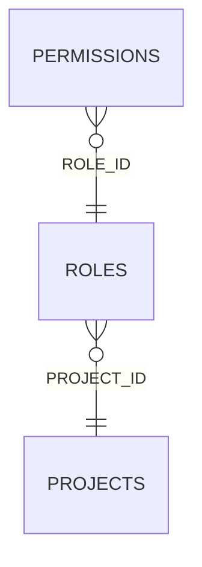

<!-- superdev:generated source=ENT-0020 revision=2087 hash=9c2a54a133280d2ff77f8c3ac4ba87a1d123b932203950f57bb4a6be540e5bd0 -->
# Entity: roles

- **Status:** Specified
- **Owning module:** Product Model and Orchestration
- **Store:** project database
- **Schema source:** docs/prd.md section 14.1
- **Sensitivity:** none
- **Last verified:** see the generation marker at the top of this file.

## Purpose

A person or system actor.

## Fields

| Field | Type | Null | Default | Constraints | Sensitivity |
|---|---|---|---|---|---|
| id | text | y | - | none | none |
| project_id | text | n | - | none | none |
| name | text | n | - | none | none |
| description | text | y | - | none | none |
| sequence | integer | n | 0 | none | none |
| who | text | y | - | none | none |
| primary_goals | text | y | - | none | none |

## Relationships

| Relation | Direction | Target | Cardinality | On delete | Ownership |
|---|---|---|---|---|---|
| project_id | outgoing | projects | n:1 | cascade | roles.project_id references projects.id. |
| role_id | incoming | permissions | n:1 | cascade | permissions.role_id references roles.id. |

## Lifecycle

- **Created by:** no operation recorded
- **Read or updated by:** no operation recorded
- **Deleted:** Not recorded
- **Retention:** none declared

## Indexes and uniqueness

- None recorded. The schema source outranks this prose.

## Migration notes

| Migration | Forward | Rollback | Compatibility | Status |
|---|---|---|---|---|
| 001_initial.sql | Creates 58 tables and alters 0. Tables touched: projects, source_material, discovery_items, discovery_links, questions, goals, goal_success_criteria, milestones, modules, features. | Restore the backup taken immediately before this migration ran. The runner writes one with VACUUM INTO before applying anything, and prints its path. There is no down migration: section 12.3 requires ordered migration files and forbids direct schema push, and a reversal written by hand would be a second unversioned path. | Recorded checksum 685c01b253bea226. The migrations validator rebuilds the schema from every file and reports drift if this file changes after being applied. | Applied |
| 002_docs_coverage.sql | Creates 6 tables and alters 4. Tables touched: project_scope_items, glossary_terms, runtime_pieces, runtime_piece_edges, decision_links, capability_areas_v2, decisions, roles, documents. | Restore the backup taken immediately before this migration ran. The runner writes one with VACUUM INTO before applying anything, and prints its path. There is no down migration: section 12.3 requires ordered migration files and forbids direct schema push, and a reversal written by hand would be a second unversioned path. | Recorded checksum 4e7f28afe6bee99d. The migrations validator rebuilds the schema from every file and reports drift if this file changes after being applied. | Applied |
