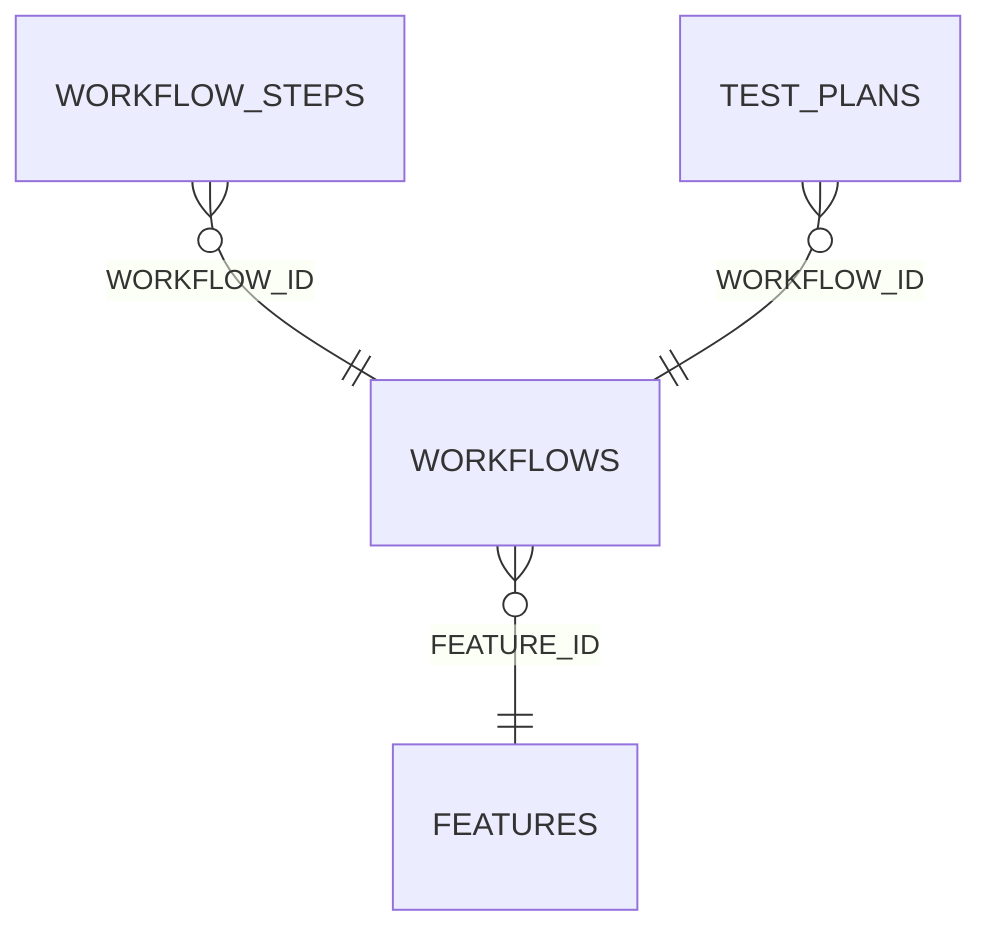

<!-- superdev:generated source=ENT-0007 revision=2087 hash=a0478df48a1391d735f369f3b4a7f5572ba5ab6f358e7539c3804ad5346c0be9 -->
# Entity: workflows

- **Status:** Specified
- **Owning module:** Product Model and Orchestration
- **Store:** project database
- **Schema source:** docs/prd.md section 14.1
- **Sensitivity:** none
- **Last verified:** see the generation marker at the top of this file.

## Purpose

An ordered journey that produces an outcome, spanning one or more features and modules.

## Fields

| Field | Type | Null | Default | Constraints | Sensitivity |
|---|---|---|---|---|---|
| id | text | y | - | none | none |
| feature_id | text | n | - | none | none |
| name | text | n | - | none | none |
| purpose | text | y | - | none | none |
| trigger | text | y | - | none | none |
| preconditions_json | text | n | '[]' | none | none |
| completion_criteria | text | y | - | none | none |
| observability | text | y | - | none | none |
| status | text | n | 'draft' | none | none |
| created_at | text | n | - | none | none |
| updated_at | text | n | - | none | none |
| version | integer | n | 1 | none | none |

## Relationships

| Relation | Direction | Target | Cardinality | On delete | Ownership |
|---|---|---|---|---|---|
| feature_id | outgoing | features | n:1 | cascade | workflows.feature_id references features.id. |
| workflow_id | incoming | workflow_steps | n:1 | cascade | workflow_steps.workflow_id references workflows.id. |
| workflow_id | incoming | test_plans | n:1 | cascade | test_plans.workflow_id references workflows.id. |

## Lifecycle

- **Created by:** no operation recorded
- **Read or updated by:** superdev workflow list
- **Deleted:** Not recorded
- **Retention:** none declared

## Indexes and uniqueness

- None recorded. The schema source outranks this prose.

## Migration notes

| Migration | Forward | Rollback | Compatibility | Status |
|---|---|---|---|---|
| 001_initial.sql | Creates 58 tables and alters 0. Tables touched: projects, source_material, discovery_items, discovery_links, questions, goals, goal_success_criteria, milestones, modules, features. | Restore the backup taken immediately before this migration ran. The runner writes one with VACUUM INTO before applying anything, and prints its path. There is no down migration: section 12.3 requires ordered migration files and forbids direct schema push, and a reversal written by hand would be a second unversioned path. | Recorded checksum 685c01b253bea226. The migrations validator rebuilds the schema from every file and reports drift if this file changes after being applied. | Applied |
