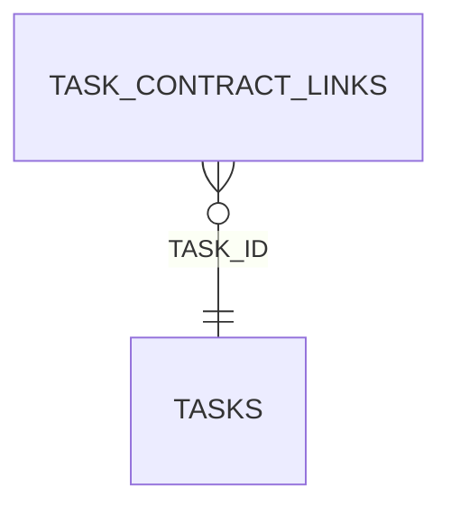

<!-- superdev:generated source=ENT-0026 revision=2087 hash=1f524b992991c31be0562dc0d4f466b513c4fe3e6c15c69229e3b82f00bd5ac3 -->
# Entity: task_contract_links

- **Status:** Specified
- **Owning module:** Task and Implementation Lifecycle
- **Store:** project database
- **Schema source:** docs/prd.md section 14.1
- **Sensitivity:** none
- **Last verified:** see the generation marker at the top of this file.

## Purpose

The accepted contract, UI, API, schema, integration, job, webhook, permission, or non functional requirement, that a task implements.

## Fields

| Field | Type | Null | Default | Constraints | Sensitivity |
|---|---|---|---|---|---|
| task_id | text | n | - | none | none |
| target_type | text | n | - | none | none |
| target_id | text | n | - | none | none |
| relationship | text | n | 'implements' | none | none |

## Relationships

| Relation | Direction | Target | Cardinality | On delete | Ownership |
|---|---|---|---|---|---|
| task_id | outgoing | tasks | n:1 | cascade | task_contract_links.task_id references tasks.id. |

## Lifecycle

- **Created by:** no operation recorded
- **Read or updated by:** no operation recorded
- **Deleted:** Not recorded
- **Retention:** none declared

## Indexes and uniqueness

- None recorded. The schema source outranks this prose.

## Migration notes

| Migration | Forward | Rollback | Compatibility | Status |
|---|---|---|---|---|
| 001_initial.sql | Creates 58 tables and alters 0. Tables touched: projects, source_material, discovery_items, discovery_links, questions, goals, goal_success_criteria, milestones, modules, features. | Restore the backup taken immediately before this migration ran. The runner writes one with VACUUM INTO before applying anything, and prints its path. There is no down migration: section 12.3 requires ordered migration files and forbids direct schema push, and a reversal written by hand would be a second unversioned path. | Recorded checksum 685c01b253bea226. The migrations validator rebuilds the schema from every file and reports drift if this file changes after being applied. | Applied |
