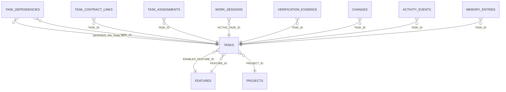

<!-- superdev:generated source=ENT-0024 revision=2087 hash=04f1a2a0dfe8ba78682bd8bb63204b53a6a154b6f323b513156007f3ecb9396d -->
# Entity: tasks

- **Status:** Specified
- **Owning module:** Task and Implementation Lifecycle
- **Store:** project database
- **Schema source:** docs/prd.md section 14.1
- **Sensitivity:** none
- **Last verified:** see the generation marker at the top of this file.

## Purpose

A bounded implementation unit.

## Fields

| Field | Type | Null | Default | Constraints | Sensitivity |
|---|---|---|---|---|---|
| id | text | y | - | none | none |
| project_id | text | n | - | none | none |
| feature_id | text | n | - | none | none |
| parent_task_id | text | y | - | none | none |
| category_id | text | y | - | none | none |
| name | text | n | - | none | none |
| description | text | y | - | none | none |
| expected_outcome | text | y | - | none | none |
| why_needed | text | y | - | none | none |
| completion_criteria_json | text | n | '[]' | none | none |
| verification_requirements_json | text | n | '[]' | none | none |
| affected_boundaries_json | text | n | '[]' | none | none |
| priority | text | n | 'normal' | none | none |
| risk | text | y | - | none | none |
| status | text | n | 'draft' | none | none |
| enabling | integer | n | 0 | none | none |
| enabled_feature_id | text | y | - | none | none |
| enabling_rationale | text | y | - | none | none |
| estimate | text | y | - | none | none |
| due_at | text | y | - | none | none |
| started_at | text | y | - | none | none |
| completed_at | text | y | - | none | none |
| cancelled_at | text | y | - | none | none |
| block_reason | text | y | - | none | none |
| sequence | integer | n | 0 | none | none |
| created_at | text | n | - | none | none |
| updated_at | text | n | - | none | none |
| version | integer | n | 1 | none | none |

## Relationships

| Relation | Direction | Target | Cardinality | On delete | Ownership |
|---|---|---|---|---|---|
| enabled_feature_id | outgoing | features | n:1 | set_null | tasks.enabled_feature_id references features.id. |
| feature_id | outgoing | features | n:1 | restrict | tasks.feature_id references features.id. |
| project_id | outgoing | projects | n:1 | cascade | tasks.project_id references projects.id. |
| depends_on_task_id | incoming | task_dependencies | n:1 | cascade | task_dependencies.depends_on_task_id references tasks.id. |
| task_id | incoming | task_dependencies | n:1 | cascade | task_dependencies.task_id references tasks.id. |
| task_id | incoming | task_contract_links | n:1 | cascade | task_contract_links.task_id references tasks.id. |
| task_id | incoming | task_assignments | n:1 | cascade | task_assignments.task_id references tasks.id. |
| active_task_id | incoming | work_sessions | n:1 | set_null | work_sessions.active_task_id references tasks.id. |
| task_id | incoming | verification_evidence | n:1 | cascade | verification_evidence.task_id references tasks.id. |
| task_id | incoming | changes | n:1 | set_null | changes.task_id references tasks.id. |
| task_id | incoming | activity_events | n:1 | set_null | activity_events.task_id references tasks.id. |
| task_id | incoming | memory_entries | n:1 | set_null | memory_entries.task_id references tasks.id. |

## Lifecycle

- **Created by:** no operation recorded
- **Read or updated by:** superdev derive, superdev task list
- **Deleted:** Not recorded
- **Retention:** none declared

## Indexes and uniqueness

- None recorded. The schema source outranks this prose.

## Migration notes

| Migration | Forward | Rollback | Compatibility | Status |
|---|---|---|---|---|
| 001_initial.sql | Creates 58 tables and alters 0. Tables touched: projects, source_material, discovery_items, discovery_links, questions, goals, goal_success_criteria, milestones, modules, features. | Restore the backup taken immediately before this migration ran. The runner writes one with VACUUM INTO before applying anything, and prints its path. There is no down migration: section 12.3 requires ordered migration files and forbids direct schema push, and a reversal written by hand would be a second unversioned path. | Recorded checksum 685c01b253bea226. The migrations validator rebuilds the schema from every file and reports drift if this file changes after being applied. | Applied |
