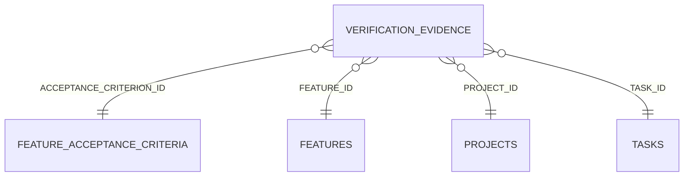

<!-- superdev:generated source=ENT-0032 revision=2087 hash=dc5c9d49768fc95b006f6bcb2d93235df83307cf291d26ceb351880fe730bf86 -->
# Entity: verification_evidence

- **Status:** Specified
- **Owning module:** Task and Implementation Lifecycle
- **Store:** project database
- **Schema source:** docs/prd.md section 14.1
- **Sensitivity:** none
- **Last verified:** see the generation marker at the top of this file.

## Purpose

Proof that a requirement or task works.

## Fields

| Field | Type | Null | Default | Constraints | Sensitivity |
|---|---|---|---|---|---|
| id | text | y | - | none | none |
| project_id | text | n | - | none | none |
| task_id | text | y | - | none | none |
| feature_id | text | y | - | none | none |
| acceptance_criterion_id | text | y | - | none | none |
| evidence_type | text | n | - | none | none |
| summary | text | n | - | none | none |
| reference | text | y | - | none | none |
| result | text | n | 'pass' | none | none |
| content_hash | text | y | - | none | secret |
| recorded_by | text | y | - | none | none |
| recorded_at | text | n | - | none | none |
| stale_at | text | y | - | none | none |
| status | text | n | 'current' | none | none |
| check_command | text | y | - | none | none |
| last_checked_at | text | y | - | none | none |
| last_check_result | text | y | - | none | none |

## Relationships

| Relation | Direction | Target | Cardinality | On delete | Ownership |
|---|---|---|---|---|---|
| acceptance_criterion_id | outgoing | feature_acceptance_criteria | n:1 | set_null | verification_evidence.acceptance_criterion_id references feature_acceptance_criteria.id. |
| feature_id | outgoing | features | n:1 | cascade | verification_evidence.feature_id references features.id. |
| project_id | outgoing | projects | n:1 | cascade | verification_evidence.project_id references projects.id. |
| task_id | outgoing | tasks | n:1 | cascade | verification_evidence.task_id references tasks.id. |

## Lifecycle

- **Created by:** no operation recorded
- **Read or updated by:** no operation recorded
- **Deleted:** Not recorded
- **Retention:** none declared

## Indexes and uniqueness

- None recorded. The schema source outranks this prose.

## Migration notes

| Migration | Forward | Rollback | Compatibility | Status |
|---|---|---|---|---|
| 001_initial.sql | Creates 58 tables and alters 0. Tables touched: projects, source_material, discovery_items, discovery_links, questions, goals, goal_success_criteria, milestones, modules, features. | Restore the backup taken immediately before this migration ran. The runner writes one with VACUUM INTO before applying anything, and prints its path. There is no down migration: section 12.3 requires ordered migration files and forbids direct schema push, and a reversal written by hand would be a second unversioned path. | Recorded checksum 685c01b253bea226. The migrations validator rebuilds the schema from every file and reports drift if this file changes after being applied. | Applied |
| 005_executable_evidence.sql | Creates 0 tables and alters 1. Tables touched: verification_evidence. | Restore the backup taken immediately before this migration ran. The runner writes one with VACUUM INTO before applying anything, and prints its path. There is no down migration: section 12.3 requires ordered migration files and forbids direct schema push, and a reversal written by hand would be a second unversioned path. | Recorded checksum 79ab511cc3ce667e. The migrations validator rebuilds the schema from every file and reports drift if this file changes after being applied. | Applied |
