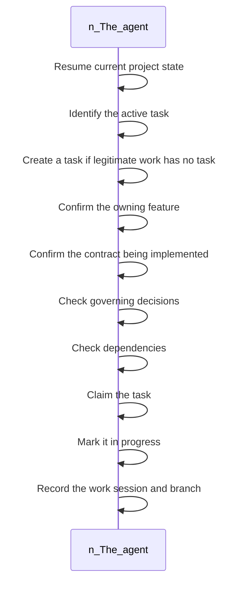

<!-- superdev:generated source=WF-0003 revision=681 hash=37db6b5f987565caf750d4e1ecb7263b8e92f962d29f0c7ed5977f3cdd025277 -->
# Pre-Implementation Setup

- **Status:** Specified
- **Module:** Task and Implementation Lifecycle
- **Feature:** Derive initial implementation tasks
- **Last verified:** see the generation marker at the top of this file.

## Workflow

- **Purpose:** The agent holds a claimed, in-progress task tied to a confirmed feature and contract, with decisions and dependencies checked, ready to implement
- **Actors:** none recorded
- **Trigger:** The agent is about to modify product code
- **Preconditions:** none recorded

| Step | Owner | Action | Input | Expected result | On failure |
|---|---|---|---|---|---|
| 1 | The agent | Resume current project state | - | The agent knows where the project stands | - |
| 2 | The agent | Identify the active task | - | The correct task in scope is identified | - |
| 3 | The agent | Create a task if legitimate work has no task | - | No work proceeds untracked | If no task fits, a new one is created before continuing |
| 4 | The agent | Confirm the owning feature | - | The task's parent feature is confirmed | - |
| 5 | The agent | Confirm the contract being implemented | - | The implementation target is unambiguous | - |
| 6 | The agent | Check governing decisions | - | The work does not contradict an accepted decision | - |
| 7 | The agent | Check dependencies | - | Blocking dependencies are known before work starts | - |
| 8 | The agent | Claim the task | - | The task is assigned to this agent | - |
| 9 | The agent | Mark it in progress | - | Task state reflects active work | - |
| 10 | The agent | Record the work session and branch | - | The work is traceable to a session and a branch | - |

- **Completion:** The agent holds a claimed, in-progress task tied to a confirmed feature and contract, with decisions and dependencies checked, ready to implement
- **Observability:** Not recorded

No branches recorded. A workflow with no alternate path is either trivial or unfinished.

