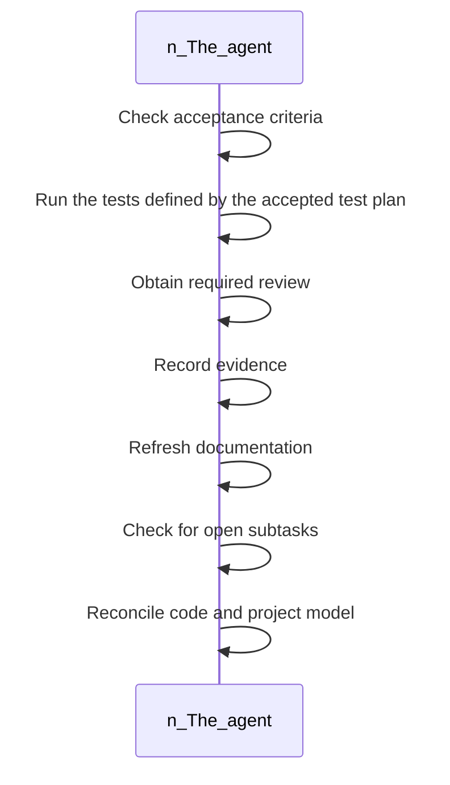

<!-- superdev:generated source=WF-0004 revision=681 hash=ab8608c7456098035adfbe8e5cbd6ae5f93137388382751b8f93fb39780880be -->
# Task Completion Gate

- **Status:** Specified
- **Module:** Task and Implementation Lifecycle
- **Feature:** Complete a task
- **Last verified:** see the generation marker at the top of this file.

## Workflow

- **Purpose:** The task is marked complete only once every completion condition checks out
- **Actors:** none recorded
- **Trigger:** The agent believes a task's work is finished and wants to close it
- **Preconditions:** none recorded

| Step | Owner | Action | Input | Expected result | On failure |
|---|---|---|---|---|---|
| 1 | The agent | Check acceptance criteria | - | Acceptance criteria are confirmed satisfied | - |
| 2 | The agent | Run the tests defined by the accepted test plan | - | Product tests pass | If tests fail, the task cannot complete |
| 3 | The agent | Obtain required review | - | Review is recorded as complete | - |
| 4 | The agent | Record evidence | - | Proof of completion is stored | - |
| 5 | The agent | Refresh documentation | - | Documentation matches the implementation | - |
| 6 | The agent | Check for open subtasks | - | No required subtask remains open | - |
| 7 | The agent | Reconcile code and project model | - | The code and the project model agree | If any check fails, the task stays open until it is resolved |

- **Completion:** The task is marked complete only once every completion condition checks out
- **Observability:** Not recorded

No branches recorded. A workflow with no alternate path is either trivial or unfinished.

