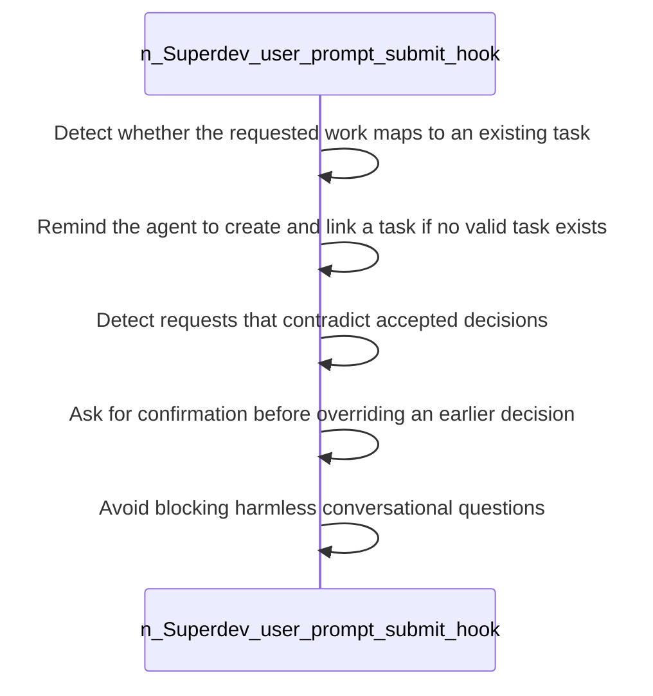

<!-- superdev:generated source=WF-0006 revision=681 hash=b67726d0efa7b5f0e27b9f93fd102123c300bd8c411fe5be56dfc499e33812ae -->
# User Prompt Submit Hook

- **Status:** Specified
- **Module:** Task and Implementation Lifecycle
- **Feature:** Detect unlinked work at prompt time
- **Last verified:** see the generation marker at the top of this file.

## Workflow

- **Purpose:** The prompt is checked against existing tasks and accepted decisions before the agent acts on it
- **Actors:** none recorded
- **Trigger:** The user submits a prompt
- **Preconditions:** none recorded

| Step | Owner | Action | Input | Expected result | On failure |
|---|---|---|---|---|---|
| 1 | Superdev (user prompt submit hook) | Detect whether the requested work maps to an existing task | - | A match is found, or its absence is noted | - |
| 2 | Superdev (user prompt submit hook) | Remind the agent to create and link a task if no valid task exists | - | Work is not carried out untracked | - |
| 3 | Superdev (user prompt submit hook) | Detect requests that contradict accepted decisions | - | Conflicts with existing decisions are caught before acting | - |
| 4 | Superdev (user prompt submit hook) | Ask for confirmation before overriding an earlier decision | - | The owner explicitly approves any decision reversal | Without confirmation, the earlier decision stands |
| 5 | Superdev (user prompt submit hook) | Avoid blocking harmless conversational questions | - | Casual or non-work prompts pass through without interruption | - |

- **Completion:** The prompt is checked against existing tasks and accepted decisions before the agent acts on it
- **Observability:** Not recorded

No branches recorded. A workflow with no alternate path is either trivial or unfinished.

